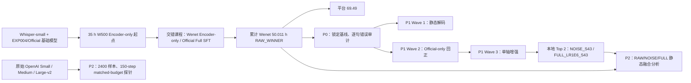

# Cantonese ASR Lab：RAW_WINNER P0–P2 完整技术报告

> 本文档是 RAW_WINNER 技术路线的唯一推荐入口，汇总 69.49 获胜训练链、P0 冻结基线与误差审计、P1 八卡低风险改进，以及 P2 八卡结构性探针。仓库安装、脚本索引和公开方法概览请返回 [`README.md`](../README.md)。

本仓库记录点心杯粤语 ASR 项目的训练、评测与离线提交流程。平台获胜系统固定为
`openai/whisper-small`，不修改 tokenizer 或词表，也不使用模型融合、外部语言模型、
动态 fallback 或 LoRA；P2 另行把 LoRA、字符 LM 与离线融合作为结构性探针，它们
没有混入 69.49 提交包。

当前已验证的平台基线为 `W500_Adaptive_RAW_WINNER`：

| 指标 | 数值 |
|---|---:|
| Platform score | **69.49** |
| Hidden-200 CER | 0.247305 |
| Hidden-200 sentence accuracy（tol2） | 0.340000 |

## 0. 读图、范围与证据等级

### 0.0 目录

- [A. 平台获胜前的 W500 自适应训练链](#a-平台获胜前的-w500-自适应训练链)
- [P0：冻结起点、数据、指标与误差审计](#2-p0冻结-raw_winner-起点)
- [P1 Wave 1：静态解码消融](#6-wave-1静态解码消融)
- [P1 Wave 2：Official-only 回正](#7-wave-2official-only-短程回正)
- [P1 Wave 3：单轴增强](#8-wave-3单轴增强)
- [P1 本地 Top 2 与提交验收](#9-标准化复评与本地-top-2)
- [P2：matched-budget 结构性探针](#13-p2150-step-matched-budget-结构性探针)
- [P2 容量与 PEFT](#15-p2-容量与-peft-结果)
- [P2 Tokenizer、字符 LM 与融合](#16-p2-粤语-tokenizer-与-unicode-审计)
- [统一结论、复现清单与限制](#20-p0p2-统一结论与下一步)



### 0.1 四种证据不能互换

| 证据 | 用途 | 可以声称 | 不可以声称 |
|---|---|---|---|
| 平台 hidden-200 | 比赛最终外部结果 | RAW_WINNER 得分 69.49 | P1/P2 已超过 69.49 |
| Fixed validation 702 | checkpoint、解码、LM、融合选择 | 已预注册规则下的本地排名 | 隐藏集必然同序 |
| Public 1900 | 目标域诊断与稳定性 veto | 候选在已知 Public 上的表现 | 用 Public 反向选模 |
| OOD 2000 | 域外退化与稳健性 veto | 候选是否明显丢失泛化 | 用 OOD 单独覆盖 validation 决策 |

### 0.2 贯穿全流程的因果控制

- 每个实验只改变预注册变量；训练、解码、normalizer 与数据变化分开报告。
- P1 训练 arm 全部从相同 RAW_WINNER 权重独立初始化，不做 arm-to-arm continuation。
- P1 所有 AdamW 都重新初始化，避免继承 W500/Official optimizer moments。
- P2 六个容量 arm 使用相同 2,400 条 exposure stream 和相同全局 optimizer-step 样本 ID。
- Public/OOD 永远是诊断或否决表面；正式选择只读取 fixed validation。
- “未生成 EOS token”与“真实生成失控”分开统计，不能相互替代。
- 所有可发布权重必须通过离线加载、逐句 prediction parity、结构与 SHA-256 校验。

### 0.3 最终结论先行

- 平台已证实的最佳仍是 Whisper-small RAW_WINNER 69.49。
- P1 最稳健的训练方向是 Official-only Full SFT、LR `1e-6`；Gaussian noise 是唯一双 seed 均改善 CER 的增强轴。
- P1 两个本地候选没有自动提交平台，因此只称“本地 Top 2”。
- P2 中 Full SFT 的短预算适配效率随模型容量单调提高，Large-v2 Full 最强，但仍未超过 RAW_WINNER 的 fixed-validation 与 OOD 组合。
- P2 中 LoRA 明显省可训练参数和显存，却在 150 steps 内全面落后对应 Full SFT；这不是对充分收敛 LoRA 的否定。
- Whisper 三种尺寸使用相同 tokenizer；粤语常用字多 token 化确实存在，但没有证据证明它是主导瓶颈。
- 字符 5-gram LM 选择 `lambda=0`；静态三模型 MBR 在 Public 有收益，但 validation 未超过最佳单模型。

## A. 平台获胜前的 W500 自适应训练链

P0 的起点不是一次普通 Full SFT，而是经过 source-conditional curriculum 得到的 `checkpoint-wenet-50h`。这一节解释 69.49 权重是如何产生的；P0–P2 的所有结论都应在这个 provenance 上阅读。

### A.1 为什么把声学学习和文本校准拆开

WenetSpeech-Yue v1 500 h 能扩展粤语口音、说话人、噪声、通道和长音频覆盖，但其音频通常比 Official 短句更长，并可能包含伪标签或不同转写风格。若 Wenet batch 直接 Full SFT，Decoder 可能把外部数据的长句、用字和 EOS 行为学进去。训练因此按 source 切换参数范围：

```text
Wenet optimizer step
  ├─ Encoder（含 convolutional acoustic front end）：trainable
  ├─ Decoder：frozen
  └─ proj_out / lm_head：frozen，grad 必须为 None

Official optimizer step
  ├─ Encoder：trainable
  ├─ Decoder：trainable
  └─ proj_out / lm_head：trainable
```

一个 optimizer step 内的两个 gradient-accumulation micro-batch 必须来自同一 source，禁止在 accumulation 中混入 Wenet 与 Official。这样 Wenet step 主要扩展声学表征，Official step 持续校正短句、粤语用字、插入、重复与结束行为。

### A.2 优化器状态与交错节奏

- 使用一个重新初始化的 AdamW optimizer，而不是 Wenet/Official 各自建 optimizer。
- Encoder 在两类 step 上持续出现，因此其 AdamW moments 连续保留。
- Wenet step 将 Decoder/output 的梯度清空并断言为 `None`；Official step 恢复全模型参数组。
- 最终获胜 branch 的 source cycle 为 `[wenet, official]`，即 `1:1` 交错。
- 不使用普通 concat/shuffle；source sequence 和 cursor 写入 receipt，可从中断点复现。

### A.3 获胜 branch 的固定配置

| 项 | 值 |
|---|---|
| 初始化 | 已核验的 35 h W500 Encoder-only checkpoint |
| 分支 | `stage50/TOP2_CONSTANT_TO_50H` |
| 模型 | 原结构 Whisper-small，tokenizer/词表不变 |
| Wenet LR | `1e-6` |
| Official Full LR | `5e-7` |
| Optimizer | AdamW，重新初始化 |
| Scheduler | constant |
| Warmup | 0 |
| Weight decay | `0.01` |
| Max grad norm | `1.0` |
| Per-device batch | 8 |
| Gradient accumulation | 2 |
| Global effective batch | 16 |
| BF16 / TF32 | true / true |
| Gradient checkpointing | false |
| SpecAugment / speed / noise | 全部关闭 |
| Seed / data seed | 42 / 42 |
| Source cycle | Wenet → Official → 重复 |

### A.4 曝光不是按理论 step 推算

里程碑由每个 Wenet optimizer step 实际处理的 16 条音频 duration 累加决定，而不是用 epoch 或平均时长估算。最终收据为：

```text
cumulative Wenet seconds: 180,039.89999992028
cumulative Wenet hours:    50.0110833333
target:                    50.0000000000 h
deviation:                 +39.9 s
```

`stage50` 本段共有 132 optimizer steps，其中 66 个 Wenet、66 个 Official；Wenet cursor 为 3,232，Official cursor 为 10,944。`source_steps.jsonl` 保存每步 source、两个 micro-batch、样本 ID、音频秒数、LR 和累计 cursor，从而证明 source-homogeneous accumulation。

Wenet 使用冻结的 balanced stream manifest；完整路径、全 SHA-256 和逐样本顺序保存在该 branch 的 stream/source receipts。本报告不把未纳入版本库的长哈希以省略形式冒充可直接校验值。

Official manifest SHA-256 为：

```text
0d3d1df4b90f89907443ad9706f13d9ff0ae5fe66d6b32c939af99645867cb81
```

### A.5 参数范围收据

| 参数组 | 参数量 | Wenet step | Official step |
|---|---:|---|---|
| Encoder | 87,002,112 | train | train |
| Decoder + tied output | 153,580,800 | freeze | train |
| Optimizer 参数总量 | 240,582,912 | 仅 Encoder 有梯度 | 全部可学习参数有梯度 |

`proj_out.weight` 与 Decoder input embedding tied；冻结检查必须按 parameter identity 去重，不能因同一 tensor 有两个名字而误计。

### A.6 RAW 与插值模型的本地选择

同一训练节点还测试了 Decoder 插值，但 fixed validation 的 CER-heavy 规则最终保留 raw 权重：

| Candidate | Validation tol2 | Validation CER |
|---|---:|---:|
| RAW | **0.854701** | **0.085934** |
| MIX15 | 0.854701 | 0.087003 |
| MIX30 | 0.853276 | 0.087965 |
| MIX45 | 0.849003 | 0.089248 |
| MIX60 | 0.837607 | 0.090209 |

Public/OOD 只执行 guardrail，不重排。最终 raw checkpoint 在 hidden-200 获得：

```text
CER:                 0.2473053892215569
sentence accuracy:   0.340000 (tolerance 2)
platform final score: 69.49
```

### A.7 平台包与本地 P0/P1 解码的区别

公开平台包的独立 `predict.py` CLI 默认 `num_beams=1`、`max_length=225`；同包 `generation_config.json` 还包含 `no_repeat_ngram_size=4`、`repetition_penalty=1.05` 与 Whisper suppression lists。P0/P1 内部冻结的 `D0_CURRENT` 则显式设置 `num_beams=2`。这两者是不同调用面：

- 平台 69.49 只归因于提交包的实际调用链；
- P0/P1 比较只在其显式 D0 配置内部成立；
- 不把 beam 数变化误写为训练收益，也不声称 P1 本地指标已获得平台分数。

本文把完整工作拆成四层，避免把不同证据混为一谈：

1. **获胜训练链**：Wenet step 只更新 Encoder，Official step 做 Full SFT，最终在累计 Wenet 50 h 形成平台 69.49 RAW_WINNER；
2. **P0**：冻结模型、数据、normalizer、推理与评测顺序，并建立逐句错误基线；
3. **P1**：静态解码、Official-only 回正和单轴增强，产生两个通过完整离线验收的本地候选；
4. **P2**：以严格 150-step matched-budget 进行 Small/Medium/Large-v2、Full SFT/LoRA、Tokenizer、字符 LM 与多模型融合探针。

P2 的容量实验从各自的原始 OpenAI checkpoint 初始化，**不是**从 RAW_WINNER 继续训练；它回答短预算适配效率与资源成本问题，不是充分收敛后的架构排名。P0–P1 没有继续增加 Wenet 时长，也没有重跑此前的 W500 Encoder-only 课程训练。

## 1. P0–P1 实验原则

- 所有训练 arm 都从同一个 RAW_WINNER checkpoint 独立初始化。
- 不从其他 arm 的 checkpoint 继续训练。
- 只加载模型权重，不继承原 optimizer state；每个 arm 重新初始化 AdamW。
- checkpoint 排名只允许使用 fixed official validation。
- Public 1900 与 OOD 只能淘汰不稳定候选，不能改变 validation 排名。
- 多随机种子实验必须 seed 42 和 seed 43 方向一致，才认定配置有效。
- 每个 arm 使用独立输出目录，不覆盖已有产物。
- 不自动上传比赛平台。

## 2. P0：冻结 RAW_WINNER 起点

### 2.1 Checkpoint 与哈希

```text
/home/bolin/cantonese-asr/
outputs/w500-adaptive-continuation-v1/stage50/
TOP2_CONSTANT_TO_50H/checkpoint-wenet-50h
```

```text
model.safetensors SHA256:
a0f29a5a011213d5e4de34c40a02d42247255645f06e649e092d2dc495094370

baseline submission ZIP SHA256:
b4fda8ac549d37d8cac9797950636d50ca28f74d8e5e76e2479c15de9b956bc5
```

基线提交包大小为 `895,743,248` bytes。关键推理资产：

| 文件 | SHA256 |
|---|---|
| `config.json` | `53b4eb5c1c63510e9541417174df6ed709cd59e0b052492446ca1287088ee023` |
| `generation_config.json` | `3f2ced827b5a4b0241c4f2f8883cf13da2b00ece23c341d663333c9b07b8de64` |
| `predict.py` | `075d465a775f4ebff1f817d86ab16d3f8da0977257cdcab1870312aaa9c78546` |
| `cantonese_asr/metrics.py` | `b3a3c536c71d6156a0dc4e3ddcd8d04f24453dcca0b8a9bde86d0f33ed4799b2` |

### 2.2 模型结构

```yaml
architecture: WhisperForConditionalGeneration
d_model: 768
encoder_layers: 12
decoder_layers: 12
encoder_attention_heads: 12
decoder_attention_heads: 12
encoder_ffn_dim: 3072
decoder_ffn_dim: 3072
vocab_size: 51865
total_parameters: 241734912
```

本轮没有修改模型结构、tokenizer、词表或权重格式。

### 2.3 不可变基线收据

实验开始前生成只读 `baseline_lock.json`，锁定 checkpoint、模型权重、提交 ZIP、
配置、推理脚本、metric normalizer、三个评测 manifest、音频顺序、基线 predictions、
token sidecar 与文件 SHA256。

Wave 1 的 `D0_CURRENT` 必须在 702/1900/2000 三个表面逐句复现这份基线，
否则整个实验停止。

### 2.4 评测文件逐句锁定

`baseline_lock.json` 保存三个 surface 的 manifest、音频顺序、baseline predictions 和 token sidecar 的完整 SHA-256。任何重跑先核验 row count、audio key 顺序、normalized reference 和逐句 prediction；总指标相同但逐句顺序不同也视为 parity 失败。大体积运行 receipt 不随 Git 分发，因此本文只列可由版本库或 final matrix 完整验证的哈希，不截短其余值来冒充可执行校验值。

### 2.5 P0 全量基线

| Surface | Rows | tol2 | tol1 | tol0 | CER | S/D/I | Severe | Top-20 contribution | Repeat | `�` | Max hit | no-EOS |
|---|---:|---:|---:|---:|---:|---|---:|---:|---:|---:|---:|---:|
| Validation | 702 | 0.854701 | 0.709402 | 0.454416 | 0.085934 | 607/103/94 | 14 | 0.172886 | 0 | 0 | 0 | 201 |
| Public | 1900 | 0.894211 | 0.751579 | 0.450000 | 0.081328 | 1704/101/23 | 8 | 0.059081 | 0 | 0 | 0 | 566 |
| OOD | 2000 | 0.331500 | 0.159000 | 0.042000 | 0.340429 | 8075/81/48 | 515 | 0.040834 | 0 | 0 | 0 | 535 |

这些 P0 数值是后续 guardrail 和 delta 的唯一参考。隐藏平台的 200 条并不等于这里的 Public 1900，不能直接比较 CER 的绝对值。

### 2.6 P0 错误切片

可用 metadata 不完整，因此只报告有稳定字段的切片，不伪造 speaker/program/noise 标签：

| Surface / Slice | Samples | CER | 解释 |
|---|---:|---:|---|
| Validation, 22.05 kHz | 68 | 0.082645 | 小样本诊断 |
| Validation, 44.1 kHz | 634 | 0.086211 | validation 主体 |
| Validation, Cantonese markers | 508 | 0.085866 | 含粤语口语标记 |
| Validation, digits | 5 | 0.224138 | 样本太少，只提示数字风险 |
| Validation, Latin/code-switch | 6 | 0.022472 | 样本太少，不作泛化结论 |
| Validation, other | 183 | 0.085012 | 其余文本 |
| Public, Cantonese markers | 1698 | 0.074513 | 明显好于非 marker 子集 |
| Public, other | 202 | 0.148219 | 主要 Public 风险切片之一 |
| OOD, CV zh-HK | 1000 | 0.361556 | 比 MDCC 难 |
| OOD, MDCC | 1000 | 0.322909 | OOD 较好子域 |
| OOD, 16 kHz | — | 0.322909 | 与 MDCC 构成高度相关 |
| OOD, 32 kHz | — | 0.375000 | 高误差诊断 |
| OOD, 44.1 kHz | 29 | 0.308824 | 样本少 |
| OOD, 48 kHz | — | 0.361538 | 高误差诊断 |
| OOD, Cantonese markers | 1131 | 0.324656 | 好于 other |
| OOD, Latin/code-switch | 6 | 0.370370 | 样本少 |
| OOD, other | 863 | 0.374570 | OOD 主要风险切片 |

P0 不能完整回答 speaker/program/时长/噪声归因，因为对应字段在部分 surface 缺失。后续报告必须把“字段缺失”写成限制，而不是把未切片的误差解释成某个说话人或通道效应。

## 3. P0–P1 数据与隔离

### 3.1 Official train

```text
artifacts/manifests/train.jsonl
rows: 6292
SHA256: 0d3d1df4b90f89907443ad9706f13d9ff0ae5fe66d6b32c939af99645867cb81
```

Wave 2 和 Wave 3 每个训练 arm 的真实 source exposure：

```text
Official: 2400 samples
Wenet:    0
CV:       0
MDCC:     0
```

本轮测量的是 Official 短程校准与增强效果，不是新的 Wenet 训练收益。

### 3.2 Fixed validation

```text
artifacts/manifests/validation.jsonl
rows: 702
reference field: text
SHA256: 8c2310529ae8d257cb9612dc85797aff5952a5b2b6078cd146db486daf9eee4a
```

Validation 是唯一 checkpoint 排名表面。

### 3.3 Public 1900

```text
artifacts/datasets/official/template_pre.jsonl
rows: 1900
reference field: ref_text
SHA256: 95bb1f05b648c6a2ec2e3b23b6b725a02143da0259804af631f5afa6a4367c50
```

### 3.4 OOD panel

```text
artifacts/manifests/ood/v1/ood_panel.jsonl
rows: 2000
reference field: text
SHA256: 1ab5f1547bc7c93713e99bfb749e1359ed97e98dd8258bf448656da53abb6450
```

Public 与 OOD 均不进入训练和 checkpoint 排名。

### 3.5 已有数据策略的关闭证据

P1 没有重跑 Short 5–7 s 或 TargetMatched-HQ。此前严格控制的 paired-seed 实验中，这两种 Wenet 子集策略都未在 seed 42 与 43 上稳定超过 Current Wenet 对照，因此本轮把它们登记为已关闭方向。该决定用于减少重复计算，不代表“任何短音频筛选都不可能有效”；它只否定已经运行的具体 manifest、采样与预算组合。

### 3.5 音频与标签输入

音频由 `librosa.load` 解码为 16 kHz、单声道 `float32`，随后通过 Whisper feature
extractor 生成 input features 与 attention mask。训练增强完成后执行：

```python
np.nan_to_num(audio, nan=0.0, posinf=1.0, neginf=-1.0)
```

Official manifest 的 `text` 字段直接送入 Whisper tokenizer；训练 loader 不执行
粤语到普通话的词汇改写。

## 4. 指标与文本规范化

Reference 不做 OpenCC，只删除预定义中英文标点、空格、换行与可选的
`[RAW]`/`[NORM]` 前缀。Prediction 先执行 OpenCC `t2s`，再执行同样的标点和
空白清理。该非对称行为用于匹配比赛评测逻辑。

```text
CER = 全集字符编辑距离总和 / normalized reference 字符数总和

tol0 = edit distance == 0
tol1 = edit distance <= 1
tol2 = edit distance <= 2
```

字符编辑距离使用 Levenshtein distance，并分别统计 substitutions、deletions 和
insertions。严重错误定义为 `character edit distance > 5`；
`top_20_error_contribution` 是编辑距离最大的20条样本对全集总编辑距离的贡献。

每个评测表面同时记录：

- `repeated_runaway_count`、`token_cycle_count`、`long_text_repeat_count`；
- `no_eos_count`；
- replacement character `�` 数量；
- effective max-length count；
- token length mean/P50/P90/P95/P99/max。

`no_eos_count` 是 token-side 诊断，不等同于真实重复失控。真实 repeated runaway
要求出现 token/text 循环或大量 replacement characters。

Whisper 有4个 decoder prompt tokens，因此有效长度命中定义为：

```text
generated token count + 4 >= max_length
```

### 4.1 Reference 来源与 normalizer 非对称性

- Official validation/OOD 的 reference 来自 manifest `text`；Public 来自 `ref_text`。
- 正式评测不从音频文件名构造 reference，也不使用普通话翻译字段。
- Reference 保持原标签文字，只做标点/空格/prefix 清理；Prediction 额外先做 OpenCC `t2s`。
- 这会对“普通话书面 reference vs 自然粤语 prediction”及繁简/异体字产生风格惩罚，但为了和比赛一致，正式 CER 不改成双边 OpenCC。
- 双边 t2s 或语义等价分析只能作为诊断，不能替换本文的正式指标。

### 4.2 生成稳定性判定

`repeated_runaway_count` 由 token 1–4 gram 循环、长文本字符/短语循环、replacement character 大量出现或有效 max-length 命中等证据组成。`no_eos_count` 只说明 sidecar 中未观察到 EOS；短输出、padding 或库版本的返回序列语义都可能导致 no-EOS，因此不把它直接加进 runaway。

## 5. 环境与八卡拓扑

一份正式运行收据记录的主要环境：

```yaml
python: 3.11.15
torch: 2.6.0+cu124
cuda_runtime: 12.4
gpu: NVIDIA GeForce RTX 4090
precision: BF16
tf32: true
gradient_checkpointing: false
```

八张 GPU 来自两台四卡节点：

```text
gpu001: physical GPU 0,1,2,3
gpu002: physical GPU 0,1,2,3
```

八卡运行的是八个独立单卡实验，不是一个八卡 DDP 模型。每个训练 arm 的有效
batch 为：

```text
per-device batch 8 × gradient accumulation 2 × world size 1 = 16
```

八卡只用于并行搜索配置，不改变单个模型的优化轨迹。

## 6. Wave 1：静态解码消融

### 6.1 共同参数

```yaml
language: zh
task: transcribe
return_timestamps: false
do_sample: false
length_penalty: 1.0
max_new_tokens: null
```

长度控制实际使用 `max_length`，不是 `max_new_tokens`。

### 6.2 八个 arm

| Arm | beams | max_length | no-repeat n-gram | repetition penalty | 说明 |
|---|---:|---:|---:|---:|---|
| D0_CURRENT | 2 | 225 | 4 | 1.05 | 基线 |
| D1_BEAM1 | 1 | 225 | 4 | 1.05 | 单 beam 确定性解码 |
| D2_BEAM4 | 4 | 225 | 4 | 1.05 | Beam 4 |
| D3_BEAM5 | 5 | 225 | 4 | 1.05 | Beam 5 |
| D4_MAX128 | 2 | 128 | 4 | 1.05 | 只缩短长度上限 |
| D5_RP100 | 2 | 225 | 4 | 1.00 | 关闭额外重复惩罚 |
| D6_RP110 | 2 | 225 | 4 | 1.10 | 加强重复惩罚 |
| D7_MBR_B5 | 5 | 225 | 4 | 1.05 | 五候选字符级 MBR |

Beam 大于1时传入 `early_stopping=true`。部分 Transformers 版本会提示该 flag
可能被忽略，因此它不被视为独立收益来源；最终包仍执行 raw/ZIP 推理 parity。

### 6.3 D7 MBR

D7 返回5个候选。每个候选的风险是其与其余候选之间的平均 normalized character
edit distance。依次以 MBR risk、model sequence score、原始候选排名决胜。
D7 不使用 reference、外部 LM 或动态 fallback。D7 rank-0 强制与 D3 单输出
逐句一致并经过完整 parity 验证。

### 6.4 护栏

```text
Validation tol2 >= 0.8497008547
repeated_runaway_count == 0
replacement_character_count == 0
effective_max_length_count == 0
normal_long_sentence_truncated_count == 0

Public tol2 >= 0.8892105263
Public CER  <= 0.0833275793

OOD tol2 >= 0.3265
OOD CER  <= 0.3454290634
```

通过护栏后按 Validation CER、tol2、severe、运行时间排序。Public/OOD 只能否决，
不能重新排序。

### 6.5 结果

| Arm | Val tol2 | Val CER | Severe | Runtime/s |
|---|---:|---:|---:|---:|
| D3_BEAM5 | 0.858974 | **0.084972** | **12** | 60.66 |
| D7_MBR_B5 | **0.860399** | 0.085079 | 13 | 215.74 |
| D2_BEAM4 | 0.858974 | 0.085614 | 13 | 91.25 |
| D0_CURRENT | 0.854701 | 0.085934 | 14 | 85.40 |
| D1_BEAM1 | 0.854701 | 0.085934 | 14 | 84.20 |
| D4_MAX128 | 0.854701 | 0.085934 | 14 | 118.77 |
| D5_RP100 | 0.854701 | 0.085934 | 14 | 118.89 |
| D6_RP110 | 0.856125 | 0.085934 | 14 | 118.90 |

Wave 1 胜出配置为 `D3_BEAM5`：

| Surface | tol2 | CER |
|---|---:|---:|
| Validation | 0.858974 | 0.084972 |
| Public | 0.895789 | 0.080482 |
| OOD | 0.333000 | 0.339350 |

解码胜出配置不会被强制套到后续新模型。每个最终候选仍分别测试 D0 与 D3。

## 7. Wave 2：Official-only 短程回正

### 7.1 实验矩阵

```text
2种更新范围 × 2个学习率 × 2个随机种子 = 8 arms
```

| Mode | LR | Seeds |
|---|---:|---|
| Decoder-only | 5e-7 | 42, 43 |
| Decoder-only | 1e-6 | 42, 43 |
| Full SFT | 5e-7 | 42, 43 |
| Full SFT | 1e-6 | 42, 43 |

### 7.2 统一训练配置

```yaml
initial_checkpoint: RAW_WINNER checkpoint-wenet-50h
training_data: Official only

optimizer: adamw_torch
optimizer_state: reinitialized
scheduler: constant
warmup_steps: 0
warmup_ratio: 0
weight_decay: 0.01
max_grad_norm: 1.0

max_steps: 150
checkpoint_steps: [25, 50, 75, 100, 125, 150]
per_device_train_batch_size: 8
gradient_accumulation_steps: 2
global_effective_batch_size: 16
expected_samples_seen: 2400

evaluation_strategy: steps
eval_batch_size: 4
logging_steps: 1
num_workers: 4
save_total_limit: 32

bf16: true
tf32: true
gradient_checkpointing: false
lora: false
early_stopping: false

generation_num_beams: 2
generation_max_length: 225
generation_no_repeat_ngram_size: 4
generation_repetition_penalty: 1.05
```

命令中的 `epochs=100` 只是高上限，实际停止条件是 `max_steps=150`。每个 arm 内
`seed=data_seed=sampling_seed`，分别使用42与43。seed 不重新生成 manifest。

Wave 2 所有增强均关闭：

```yaml
apply_spec_augment: false
mask_time_prob: 0
mask_feature_prob: 0
online_speed_perturbation: false
online_gaussian_noise: false
online_channel_bandlimit: false
```

### 7.3 Decoder-only 参数范围

冻结 `encoder.conv1`、`encoder.conv2`、`encoder.layers.0-11` 和
`encoder.layer_norm`，训练完整 Decoder 与 `proj_out`。`proj_out.weight` 与
Decoder token embedding 绑定，是同一份可训练参数。

```text
Total parameters:     241,734,912
Trainable:            153,580,800
Frozen:                88,154,112
```

### 7.4 Full SFT 参数范围

Full SFT 更新 Encoder、Decoder 与 `proj_out` 的全部可学习参数：

```text
Total parameters:     241,734,912
Trainable:            240,582,912
Frozen:                 1,152,000
```

固定的 `1,152,000` 参数是 `model.encoder.embed_positions.weight`。因此这里的
Full SFT 表示所有可学习参数开启，不是强行训练固定位置表。

### 7.5 Checkpoint 选择

每个 arm 只从六个预注册 checkpoint 中选择。先要求 Validation tol2 不低于
`0.8497008547`，通过后依次比较 CER、更高 tol2、更低 severe、更早 step。

Trainer 训练结束后重载内部 best model 生成的 `final_*` receipt 不参与选模。
配置族按 paired-seed mean CER，再按 paired-seed mean tol2 排名。

### 7.6 结果

下表为用于 checkpoint 选择的训练时预注册 Validation evaluation：

| Arm | Step | Val tol2 | Val CER | Severe | Insertions |
|---|---:|---:|---:|---:|---:|
| DECODER 5e-7 S42 | 100 | 0.861823 | 0.084972 | 14 | 100 |
| DECODER 5e-7 S43 | 75 | 0.863248 | 0.085079 | 13 | 93 |
| DECODER 1e-6 S42 | 75 | 0.864672 | 0.084117 | 13 | 97 |
| DECODER 1e-6 S43 | 125 | 0.868946 | 0.083903 | 12 | 95 |
| FULL 5e-7 S42 | 125 | 0.864672 | 0.084331 | 13 | 97 |
| FULL 5e-7 S43 | 125 | 0.863248 | 0.084438 | 12 | 93 |
| FULL 1e-6 S42 | 150 | 0.870370 | 0.083048 | 10 | 91 |
| FULL 1e-6 S43 | 125 | 0.868946 | **0.082086** | 10 | **88** |

| Family | Mean tol2 | Mean CER |
|---|---:|---:|
| Full SFT, LR 1e-6 | **0.869658** | **0.082567** |
| Decoder-only, LR 1e-6 | 0.866809 | 0.084010 |
| Full SFT, LR 5e-7 | 0.863960 | 0.084384 |
| Decoder-only, LR 5e-7 | 0.862536 | 0.085026 |

Wave 3 因此固定使用 Full SFT、LR `1e-6`。

## 8. Wave 3：单轴增强

Wave 3 保持 Official-only、Full SFT、LR `1e-6`、150 steps 与 seed 42/43，
只改变一个增强轴。验证预处理始终保持干净。

### 8.1 SpecAugment

使用 Transformers Whisper 原生实现：

```yaml
apply_spec_augment: true
mask_time_prob: 0.05
mask_time_length: 10
mask_time_min_masks: 1
mask_feature_prob: 0.05
mask_feature_length: 8
mask_feature_min_masks: 1
```

Whisper 原生 SpecAugment 没有额外全局启用概率；`mask_*_prob` 描述轴向覆盖比例。

### 8.2 Speed perturbation

每条样本从 `0.9/1.0/1.1` 等概率采样，非1.0样本使用
`librosa.effects.time_stretch`。

| Seed | 0.9 | 1.0 | 1.1 |
|---|---:|---:|---:|
| 42 | 789 | 805 | 806 |
| 43 | 810 | 785 | 805 |

### 8.3 Gaussian noise

```yaml
probability: 0.5
snr_db: Uniform(15, 25)
```

```text
signal_rms = sqrt(mean(audio^2))
noise_rms  = signal_rms / 10^(snr_db / 20)
noise      ~ Normal(0, noise_rms)
augmented  = audio + noise
```

只有 `signal_rms > 1e-8` 时才实际加入噪声；否则保留原音频并在 receipt 中记为
未命中。

| Seed | Applied | Total |
|---|---:|---:|
| 42 | 1212 | 2400 |
| 43 | 1188 | 2400 |

### 8.4 Telephone channel

每条样本以0.5概率执行四阶 Butterworth `300-3400 Hz` band-pass。实现使用
second-order sections 与 `scipy.signal.sosfilt`，随后以 `resample_poly` 从16 kHz
降采样至8 kHz、恢复至16 kHz，并 pad 或截断至原始长度。

| Seed | Applied | Total |
|---|---:|---:|
| 42 | 1203 | 2400 |
| 43 | 1221 | 2400 |

### 8.5 增强随机性与互斥

在线增强使用可复现、worker-local 的独立随机流：

```text
stable_seed(training_seed, worker_seed, augmentation_stream)
```

Speed、noise、channel 使用不同 stream。训练入口强制 SpecAugment、speed、noise、
channel 四个轴互斥。

### 8.6 配置族通过条件

增强族必须两个 seed 都有通过 tol2 护栏的 checkpoint，而且 seed42 和 seed43
的 CER 都优于相同 seed 的无增强 Full-SFT 控制。

### 8.7 结果

下表同样是用于 checkpoint 选择的训练时预注册 Validation evaluation：

| Arm | Step | Val tol2 | Val CER | 相对同seed控制 |
|---|---:|---:|---:|---|
| SPEC S42 | 125 | 0.873219 | 0.083155 | FAIL |
| SPEC S43 | 125 | 0.873219 | 0.083369 | FAIL |
| SPEED S42 | 50 | 0.864672 | 0.084972 | FAIL |
| SPEED S43 | 50 | 0.861823 | 0.085720 | FAIL |
| NOISE S42 | 75 | **0.874644** | 0.082407 | PASS |
| NOISE S43 | 150 | 0.873219 | **0.081979** | PASS |
| CHANNEL S42 | 100 | 0.871795 | 0.084010 | FAIL |
| CHANNEL S43 | 125 | 0.871795 | 0.083903 | FAIL |

唯一通过 paired-seed 规则的增强为 Gaussian noise：`p=0.5`、SNR 15–25 dB。

## 9. 标准化复评与本地 Top 2

训练日志中的 checkpoint evaluation 用于选模。选出的 checkpoint 随后使用独立
评测程序，在固定音频顺序上完整重跑 Validation/Public/OOD。训练时与独立复评
指标都保留，不互相覆盖。例如 NOISE_S43：

```text
training checkpoint CER: 0.081979
independent D0 CER:       0.082086
```

最终对比表使用独立全量复评数据。

### 9.1 Top 1：NOISE_S43

```text
/home/bolin/cantonese-asr/
outputs/raw-winner-p1-v1/wave3_augmentation/v1/
NOISE_S43/checkpoint-150

model.safetensors SHA256:
949eb4e9832482ef7a7fb2de2ac3ff2a80248ab670a20490dad9e7f7c1f91844

selected decoder: D0_CURRENT
```

| Surface | tol2 | tol1 | tol0 | CER | S/D/I | Severe |
|---|---:|---:|---:|---:|---|---:|
| Validation | 0.873219 | 0.725071 | 0.462963 | 0.082086 | 581/95/92 | 12 |
| Public | 0.892632 | 0.754211 | 0.454737 | 0.080393 | 1687/93/27 | 8 |
| OOD | 0.332000 | 0.157500 | 0.042500 | 0.340844 | 8098/68/48 | 515 |

三个表面均为 `repeated runaway=0`、`replacement characters=0`、
`effective max-length=0`。

### 9.2 Top 2：FULL_LR1E6_S43

```text
/home/bolin/cantonese-asr/
outputs/raw-winner-p1-v1/wave2_recenter/v1/
FULL_LR1E6_S43/checkpoint-125

model.safetensors SHA256:
aba4a24989a8a1925ffd2da73bce427241d1fe5f9a6e3805d664a2796b5ad832

selected decoder: D0_CURRENT
```

| Surface | tol2 | tol1 | tol0 | CER | S/D/I | Severe |
|---|---:|---:|---:|---:|---|---:|
| Validation | 0.867521 | 0.719373 | 0.462963 | 0.082407 | 580/102/89 | 11 |
| Public | **0.896316** | **0.756842** | **0.460526** | **0.079592** | 1670/90/29 | 8 |
| OOD | 0.329000 | 0.156000 | 0.042000 | 0.340927 | 8085/84/47 | 515 |

Top 2 的 Public 指标优于 Top 1，但本轮规则禁止使用 Public 重排，因此不能据此
取代 validation 排名更高的 Gaussian-noise family。

### 9.3 相对 RAW_WINNER

| Candidate | Val tol2 | Val CER | Public tol2 | Public CER | OOD tol2 | OOD CER |
|---|---:|---:|---:|---:|---:|---:|
| RAW_WINNER D0 | 0.854701 | 0.085934 | 0.894211 | 0.081328 | 0.331500 | 0.340429 |
| NOISE_S43 | **0.873219** | **0.082086** | 0.892632 | 0.080393 | **0.332000** | 0.340844 |
| FULL_LR1E6_S43 | 0.867521 | 0.082407 | **0.896316** | **0.079592** | 0.329000 | 0.340927 |

## 10. Submission 打包与验证

每个 submission ZIP 必须根目录平铺、只含一个 `model.safetensors`、完全离线
加载、使用冻结的静态 `predict.py`，并通过32条 smoke、原 checkpoint/ZIP 逐句
prediction parity 与权重 SHA256 parity。`outputs_pre` 保留在 ZIP 外部。

### 10.1 NOISE_S43

```text
RAW_WINNER_P1_NOISE_S43_D0_CURRENT_submission.zip
size: 895,748,148 bytes
SHA256: 7a4c39a5874603acdcf7dc5f37be8a30e1d8f40d8650c270c44a198fcc280f85
```

### 10.2 FULL_LR1E6_S43

```text
RAW_WINNER_P1_FULL_LR1E6_S43_D0_CURRENT_submission.zip
size: 895,750,991 bytes
SHA256: c4f845e631775452d325f0be8939b2920373a2878869309435990316e72a9189
```

两个包均通过：

```text
offline32: PASS
raw/ZIP prediction parity: PASS
flat single-weight structure: PASS
weight SHA256 parity: PASS
automatic platform upload: false
```

每个包旁的 `outputs_pre` 至少包含：

```text
metrics.json
top_confusions.csv
error_examples.json
generation.json
summary.json
```

## 11. 工程保障

本轮新增或强化：

- 配置驱动的静态解码 arm 与 `.generate()` 最终参数收据；
- `max_length`/`max_new_tokens` 语义核验；
- D3/D7 rank-0 parity 与确定性字符级 MBR；
- 独立 Gaussian-noise probability 和 telephone-channel augmentation；
- 多增强轴互斥、worker-local 与 stream-specific RNG；
- Validation 无增强、16 kHz/mono/finite-audio 守卫；
- Decoder-only trainable parameter receipt；
- Official/Wenet/CV/MDCC source exposure receipt；
- 预注册 checkpoint 与 end-of-run receipt 分离；
- Public/OOD veto-only 选模守卫；
- D0 基线逐句 parity；
- offline32、raw/ZIP parity 与完整 SHA256 清单。

每个新训练或解码路径先运行32样本 smoke。单个 arm 失败时只重试该 arm，不覆盖
其他成功产物。

## 12. 本轮结论

本轮最稳定的改进路径为：

```text
RAW_WINNER
→ Official-only Full SFT
→ reinitialized AdamW
→ constant LR 1e-6
→ 150步以内选checkpoint
→ paired seeds
→ 可选单轴 Gaussian noise（p=0.5, SNR 15-25 dB）
```

实验证据表明：

- Official-only 短程 Full SFT 明显降低本地 Validation/Public CER；
- LR `1e-6` 稳定优于 `5e-7`；
- Full SFT 稳定优于 Decoder-only；
- Gaussian noise 是唯一两个 seed 都改善 CER 的增强轴；
- SpecAugment 虽提高部分 tol2，但两个 seed 的 CER 均未超过对应无增强控制；
- speed perturbation 与 telephone channel 在本设置中没有收益；
- Beam5 对原 RAW_WINNER 有效，但没有稳定迁移到新训练 checkpoint；
- 每个新权重必须重新验证解码配置，不能假定全局解码 winner 自动泛化。

Top 1 和 Top 2 尚未自动提交平台，因此不能宣称已经超过平台 `69.49`。目前能确认
的是：本地 Validation CER 改善、Public CER 改善、真实 repeated runaway 仍为0，
OOD 基本持平，并且 Gaussian-noise 方向通过 paired-seed 复现条件。

## 13. P2：150-step matched-budget 结构性探针

### 13.1 研究问题与严格 claim boundary

P2 不以“训练到收敛”为目标，而是用相同样本和 150 optimizer steps 回答五个技术报告问题：

1. 增大 Whisper 容量是否提高短预算 adaptation efficiency；
2. Full SFT 与 LoRA 在准确率、显存、吞吐和 GPU-hours 上如何权衡；
3. 标准 Whisper tokenizer 是否已被证实为粤语主导瓶颈；
4. 只用训练文本构造的字符 5-gram LM 能否利用 5-best oracle 空间；
5. RAW_WINNER、NOISE_S43 与 FULL_LR1E6_S43 是否存在可利用的预测互补性。

**不可越界的表述**：容量实验只支持“150-step、2,400 样本、已注册超参数下的适配效率”。它没有为三种模型分别调到充分收敛，也没有多 seed，因此不得称为最终架构排名。

### 13.2 P2 与 P0/P1 的初始化关系

容量/PEFT 六个 arm 全部从对应的原始 OpenAI snapshot 初始化：

```text
SMALL_*    <- original openai/whisper-small
MEDIUM_*   <- original openai/whisper-medium
LARGE_V2_* <- original openai/whisper-large-v2
```

它们没有加载 RAW_WINNER、NOISE_S43 或 FULL_LR1E6_S43 权重。只有 P2 的多模型融合部分复用 P0/P1 既有 predictions。这个设计隔离“模型容量的短程适配能力”与“W500 curriculum 已学到的能力”。

## 14. P2 固定 exposure、训练与拓扑

### 14.1 冻结输入

完整训练池：

```text
artifacts/manifests/external/round2/external73.jsonl
rows: 23,304
Official: 6,292
CV zh-HK: 8,451
MDCC base: 8,561
SHA256: 2ba7edef6811b0d3e96b3347aa70f4237ec27735652d3d313bce62525f1cdea6
```

从中用 seed 42 一次性冻结 2,400 条唯一 exposure：

```text
fixed exposure manifest:
artifacts/raw_winner_p2/preparation/external73_fixed_exposure_2400.jsonl
SHA256: ee072139724bfe27f6572b61eb03fa3abf1e078da4d0e1098af7b11f92555b8a

fixed exposure receipt SHA256:
395a5df26c77340ca59997fad263db295b5e0a00cbd36f8dcceb18c9ac9b28dd
```

第 `s` 个 optimizer step 的全局样本严格是冻结 stream 的 `[16*s, 16*(s+1))`。Topology-aware sampler 再把同一有序 global batch 分到 1/2/4 ranks 与 accumulation microsteps。重建后的 150 组全局 ID 必须逐 byte 相同，避免把 GPU 拓扑差异误认为模型差异。

### 14.2 六 arm 训练矩阵

| Arm | GPUs | Per-rank batch | Accum | Global batch | LR | 方法 |
|---|---:|---:|---:|---:|---:|---|
| SMALL_FULL | 1 | 8 | 2 | 16 | `1e-5` | Full SFT |
| SMALL_LORA | 1 | 8 | 2 | 16 | `1e-4` | LoRA |
| MEDIUM_FULL | 2 | 2 | 4 | 16 | `1e-5` | FSDP Full SFT |
| MEDIUM_LORA | 1 | 4 | 4 | 16 | `1e-4` | LoRA |
| LARGE_V2_FULL | 4 | 1 | 4 | 16 | `1e-5` | FSDP Full SFT |
| LARGE_V2_LORA | 1 | 1 | 16 | 16 | `1e-4` | LoRA |

所有 arm 共同固定：

```yaml
max_steps: 150
optimizer: adamw_torch
weight_decay: 0.01
lr_scheduler: cosine
warmup_steps: 8
max_grad_norm: 1.0
bf16: true
tf32: true
gradient_checkpointing: true
seed: 42
data_seed: 42
augmentation: none

decode:
  num_beams: 2
  do_sample: false
  no_repeat_ngram_size: 4
  repetition_penalty: 1.05
  max_length: 225
  language: zh
  task: transcribe
```

P2 与 P1 的 scheduler 不同是预注册设计：P1 是短程 Official 回正常数 LR；P2 是原始模型适配探针，采用 8-step warmup 后 cosine。二者不能合并比较成单一学习率消融。

### 14.3 LoRA 精确范围

```yaml
r: 8
alpha: 16
dropout: 0.05
target_scope: all_attention_qv
```

`all_attention_qv` 解析为 Encoder self-attention、Decoder self-attention 与 Decoder cross-attention 中的 query/value projection。只有 adapter 参数可训练；基础权重被冻结。LoRA 模型参数总量包含注入 adapter，因此略高于对应基础模型。

### 14.4 FSDP 精确语义

Medium Full 与 Large-v2 Full 使用：

```yaml
sharding_strategy: FULL_SHARD
auto_wrap_classes:
  - WhisperEncoderLayer
  - WhisperDecoderLayer
use_orig_params: true
sync_module_states: true
cpu_offload: false
```

Rank 0 使用 full-state-dict 语义导出完整 Hugging Face checkpoint；Large-v2 因体积使用标准 sharded safetensors 与 index。训练期间不启用 CPU offload，以免把“4×4090 不可行”隐藏为不受控的慢路径。Medium Full 只允许在 OOM 后退到 batch1/accum8；正式结果未需要该 fallback。

### 14.5 模型 snapshot 与转换收据

- Medium 原始 `.pt`、转换后的 safetensors 和 missing/unexpected-key 检查都写入 conversion receipt；missing/unexpected key 均为空。
- Large-v2 转换后采用两片 safetensors 与 index；源文件和完整转换 surface SHA-256 写入 conversion receipt。
- Large-v2 转换收据中固定 positional weights 的命名差异只出现在 verifier receipt；实际可学习权重无 unexpected key。
- 所有 GPU 作业离线加载本地 snapshot，防止运行期间 Hub 内容变化。

## 15. P2 容量与 PEFT 结果

### 15.1 Step 0 → Step 150 validation

| Arm | Step0 tol2 | Step0 CER | Step150 tol2 | Step150 CER | S/D/I@150 | Severe@150 | 相对自身起点 |
|---|---:|---:|---:|---:|---|---:|---|
| Small Full | 0.163818 | 0.393224 | 0.635328 | 0.162356 | 1283/104/132 | 42 | tol2↑、CER↓ |
| Small LoRA | 0.163818 | 0.393224 | 0.538462 | 0.206499 | 1665/117/150 | 82 | tol2↑、CER↓ |
| Medium Full | 0.227920 | 0.355494 | 0.715100 | 0.134139 | 1021/95/139 | 39 | tol2↑、CER↓ |
| Medium LoRA | 0.227920 | 0.355494 | 0.504274 | 0.232578 | 1774/202/200 | 119 | tol2↑、CER↓ |
| Large-v2 Full | 0.313390 | 0.319367 | **0.803419** | **0.102929** | 739/94/130 | 20 | tol2↑、CER↓ |
| Large-v2 LoRA | 0.313390 | 0.319367 | 0.789174 | 0.112869 | 818/81/157 | 22 | tol2↑、CER↓ |

所有六 arm 均同时改善自身 step0 的 tol2 与 CER，因此按预注册规则补跑 Public 1900 与 OOD 2000。

### 15.2 三个评测表面的 endpoint

| Arm | Val tol2/CER | Public tol2/CER | OOD tol2/CER | Public severe | OOD severe |
|---|---|---|---|---:|---:|
| Small Full | 0.635328 / 0.162356 | 0.714211 / 0.152956 | 0.281000 / 0.382008 | 58 | 629 |
| Small LoRA | 0.538462 / 0.206499 | 0.636316 / 0.184811 | 0.256500 / 0.412216 | 82 | 723 |
| Medium Full | 0.715100 / 0.134139 | 0.853684 / 0.095564 | 0.287500 / 0.384248 | 7 | 652 |
| Medium LoRA | 0.504274 / 0.232578 | 0.629474 / 0.191974 | 0.238000 / 0.455040 | 137 | 835 |
| Large-v2 Full | **0.803419 / 0.102929** | **0.930526 / 0.066379** | **0.332500 / 0.345865** | **5** | **519** |
| Large-v2 LoRA | 0.789174 / 0.112869 | 0.892105 / 0.086355 | 0.312500 / 0.362256 | 17 | 573 |

更细的 endpoint 错误组成：

| Arm | Val S/D/I | Val severe/top20 | Public S/D/I | Public severe/top20 | OOD S/D/I | OOD severe/top20 |
|---|---|---|---|---|---|---|
| Small Full | 1283/104/132 | 42 / 0.117182 | 3228/125/85 | 58 / 0.042176 | 9024/110/72 | 629 / 0.040843 |
| Small LoRA | 1665/117/150 | 82 / 0.099896 | 3798/241/115 | 82 / 0.037795 | 9669/162/103 | 723 / 0.038856 |
| Medium Full | 1021/95/139 | 39 / 0.129880 | 1970/85/93 | 7 / 0.050745 | 9066/86/108 | 652 / 0.042657 |
| Medium LoRA | 1774/202/200 | 119 / 0.106618 | 3257/885/173 | 137 / 0.040324 | 10428/372/166 | 835 / 0.043407 |
| Large-v2 Full | 739/94/130 | 20 / 0.155763 | 1404/66/22 | 5 / 0.071046 | 8215/76/44 | 519 / 0.041152 |
| Large-v2 LoRA | 818/81/157 | 22 / 0.144886 | 1793/100/48 | 17 / 0.063369 | 8530/141/59 | 573 / 0.040779 |

详细稳定性：所有 endpoint 的 true repeated runaway 与 max-length hit 均为 0。Small Full Public 有 6 个 replacement characters；其余列出的 endpoint replacement 为 0。Medium/Large sidecar 在此 Transformers 路径中没有保留 EOS token，因此 `no_eos_count` 等于 surface 行数；解码实际正常停止，且 repeat/replacement/max 均为 0，故不能把这个计数解释成全量 runaway。

### 15.3 资源与性能

| Arm | Params | Trainable | World | Train s | GPU-h | Samples/s | Steps/s | Peak alloc/reserved GiB | Inference mean ms | Throughput | RTF |
|---|---:|---:|---:|---:|---:|---:|---:|---|---:|---:|---:|
| Small Full | 241.7 M | 240.6 M (99.523%) | 1 | 269.6 | 0.0749 | 8.904 | 0.556 | 4.99 / 5.79 | 85.9 | 11.64/s | 0.0268 |
| Small LoRA | 242.6 M | 0.885 M (0.365%) | 1 | 328.5 | 0.0912 | 7.307 | 0.457 | 2.10 / 3.20 | 101.6 | 9.84/s | 0.0317 |
| Medium Full | 763.9 M | 762.3 M (99.799%) | 2 | 279.4 | 0.1552 | 8.590 | 0.537 | 7.12 / 10.31 | 129.2 | 7.74/s | 0.0403 |
| Medium LoRA | 766.2 M | 2.359 M (0.308%) | 1 | 1067.5 | 0.2965 | 2.248 | 0.141 | 3.93 / 4.26 | 172.0 | 5.81/s | 0.0537 |
| Large-v2 Full | 1,543.3 M | 1,541.4 M (99.876%) | 4 | 953.9 | 1.0599 | 2.516 | 0.157 | 10.80 / 17.47 | 194.3 | 5.15/s | 0.0607 |
| Large-v2 LoRA | 1,547.2 M | 3.932 M (0.254%) | 1 | 2035.9 | 0.5655 | 1.179 | 0.074 | 6.58 / 6.95 | 230.6 | 4.34/s | 0.0720 |

推理 benchmark 固定 32 条、batch1；RTF 为总 generation seconds / 总音频 seconds。Full/LoRA 的 wall time 与 GPU-hours 不仅受参数更新量影响，还受 world size、FSDP 通信、gradient checkpointing 和当前 adapter 实现影响。因此可以声称 LoRA 降低显存与可训练参数，不能泛化声称 LoRA 必然更快或更省 GPU-hours。

### 15.4 Weight 与 run-config 哈希

| Arm | Weight artifact SHA256 | Run config SHA256 |
|---|---|---|
| Small Full | `02dd4f3f74bd1f886a53f20f036bd3043c6d48050208ed8d6737a6f901b9e0e9` | `670ec0bbc2aebb7435cd593474c87d70996c5bc526b9b8d21b0f27a5891bba71` |
| Small LoRA | `197b0c4156d535bd8fcdc4367db0115e9e08b194e2bc4d093801cb7b09bf3868` | `3ea732381d998875364ecda065f13ee17d1d351a600c930254c8f9bc5d4ae7d5` |
| Medium Full | file `5857644754a9f6a96e4d4306ef82265ad7f55b9d7c0bd7028416325e9d9a2cec`; surface `8cb977fb711e332b36422b03691b8cbfbcb45ef48a571b2036735b5dd1727bba` | `c0309645298f664f35fb7ec83c65abd6a129b19aafd3e6351b27688d9055474e` |
| Medium LoRA | `dae52ba6f380a73b611602a53c7fc5ba1bb464163d0d5449ae77918b28415f34` | `8948bb1609177f4cfade1326ba363cae40e493254177b893f6fda87aeffd1dbe` |
| Large-v2 Full | surface `b904e014e7e3ba9b61aa40a506aa65153070c4a52d21a3781d6c300f1672e66a` | `ed1718b15073a84d78c16747ef54a0f8f9d31e306b22e84aa3b268d16a2fa430` |
| Large-v2 LoRA | `1c4db315cf5dfa6e0eef2fffba99ea0f823f066ab389c56eebce5b8819eafee6` | `0501850fd11238cdce6903032d068c8f4db731375e19d15e0d0fd941ceb2ac2b` |

Large-v2 Full 的 surface 包含：

```text
model.safetensors.index.json
  SHA256 037b55c07f907ab2dbebd3fcdaa1129b89c097d7cd2856b6a5386d380c01ec38
model-00001-of-00002.safetensors
  SHA256 625bc3aeb87498cbe98f50f2375a5c8f69367fc82182e39e2d46b8f4b3e549ee
model-00002-of-00002.safetensors
  SHA256 a86345874dcc7e626fddf064a90b59a4bca28947de5368102d37bdd5cef7009e
total bytes: 6,439,030,260
```

### 15.5 容量探针该如何解释

- Full SFT 在 Small → Medium → Large-v2 上呈现单调更好的 short-budget validation tol2/CER。
- Large-v2 Full 相对 Small Full 的 tol2 `+0.168091`、CER `-0.059427`，通过预注册容量收益门槛。
- 但 Large-v2 Full 的 validation tol2 `0.803419` 仍显著低于 RAW_WINNER `0.854701`；OOD CER `0.345865` 也差于 RAW `0.340429`。
- Large-v2 Full 的 Public 极强，说明容量与短程外部数据适配有潜力；要成为部署/平台候选，仍需把 RAW 的 W500 source-conditional curriculum 与 Official 回正迁移到 Large-v2，并重新做 validation/OOD 护栏。
- 每个 LoRA arm 都落后于同尺寸 Full SFT；这仅说明注册的 rank/LR/150-step recipe 不足，不代表 LoRA 在充分调参或更长训练下永远较差。

## 16. P2 粤语 Tokenizer 与 Unicode 审计

### 16.1 三个模型实际上使用同一 tokenizer

Small、Medium、Large-v2 tokenizer hash 完全相同：

```text
cd04663643cab3e7a63a1f4cf2d7913e957183dbfb1b3aaebd97992083b8af36
```

四个 surface 均为 unknown token 0、replacement character 0、control/surrogate 0、NFC change 0、NFKC change 0。因此模型尺寸差异不包含 tokenizer 差异。

Tokenizer matrix 中 Public 审计输入的 SHA256 为 `137ad7b694d330b864cf828da963a5d899d44afbf27b974f68c69d4449097640`；这是为文本审计生成的 1,900-row reference snapshot。P0 推理锁使用的原始 `template_pre.jsonl` SHA256 为 `95bb1f05b648c6a2ec2e3b23b6b725a02143da0259804af631f5afa6a4367c50`。两者用途不同：前者只做 tokenizer 文本统计，后者才是推理 manifest；审计脚本按 reference 字段读文本，不改变正式推理或评分数据。

### 16.2 Surface 统计

| Surface | Samples | Characters | Tokens | Characters/token | 单字符多 token 比率 |
|---|---:|---:|---:|---:|---:|
| Official train | 6292 | 96,092 | 124,473 | 0.771991 | 0.307570 |
| Validation | 702 | 10,749 | 13,976 | 0.769104 | 0.313518 |
| Public | 1900 | 24,979 | 34,277 | 0.728739 | 0.345690 |
| OOD | 2000 | 24,390 | 30,505 | 0.799541 | 0.287823 |

### 16.3 常用粤语字编码

| 字 | Token IDs |
|---|---|
| 唔 | `[161, 9520]` |
| 冇 | `[5676, 229]` |
| 喺 | `[5234, 118]` |
| 咗 | `[8975, 245]` |
| 嘅 | `[10756, 227]` |
| 啲 | `[3284, 110]` |
| 佢 | `[1593, 95]` |
| 嚟 | `[29593, 253]` |
| 咁 | `[8975, 223]` |

结论是“token inefficiency 可测量”，不是“tokenizer 已被证明为主要 CER 瓶颈”。没有 UNK 或 Unicode 破损意味着当前 tokenizer 能表达这些字；两 token/字可能增加序列建模难度，但本轮没有做词表扩展的受控训练，不能建立因果结论。

## 17. P2 字符 5-gram LM 静态重排

### 17.1 防泄漏设计

- LM 训练文本只读 `external73`；禁止读取 validation/Public/OOD reference。
- 使用项目既有文本 normalizer。
- 字符 5-gram，加性平滑 `alpha=0.1`。
- 复用 RAW_WINNER D7 的五候选，不重新解码或动态 fallback。
- 每条样本内部独立标准化 ASR sequence score 与 per-character LM log-prob。

组合分数：

```text
score(candidate) = z_asr(candidate) + lambda * z_lm(candidate)
lambda ∈ {0.0, 0.1, 0.2, 0.4, 0.8}
```

只按 validation 的 tol2、CER、severe、较小 lambda 顺序选择；选出的唯一 lambda 原样应用到 Public/OOD。

### 17.2 Validation 结果

| 方法 | tol2 | CER | Severe | 说明 |
|---|---:|---:|---:|---|
| Beam5 ASR top-1 | 0.858974 | **0.084972** | 12 | D3 |
| Existing MBR | 0.860399 | 0.085079 | 13 | 五候选字符 MBR |
| LM, lambda 0/0.1/0.2/0.4/0.8 | 0.858974 | 0.085293 | 13 | 五个权重输出相同指标 |
| 5-best oracle | **0.861823** | 0.084438 | 12 | 只作上限，不可部署 |

选择结果为 `lambda=0.0`。Oracle gap 存在，但训练文本 5-gram 分数无法可靠挑出更好的候选；因此本轮没有将 LM 加入正式推理，也不能声称外部 LM 已改善系统。

## 18. P2 三模型静态融合

### 18.1 输入与 parity

融合复用 D0 predictions：

```text
RAW_WINNER
NOISE_S43
FULL_LR1E6_S43
```

在 validation/Public/OOD 上先核验 702/1900/2000 行数、audio key 顺序和 normalized reference 完全一致。没有重训、权重平均或 test-time augmentation。

### 18.2 算法

- **Three-hypothesis MBR medoid**：选与其他两条 hypothesis 总字符编辑距离最小者；平局按模型 fixed-validation 排名。
- **Character ROVER**：以 MBR medoid 为 anchor 对齐三条字符序列，逐位置投票；平票保留 anchor。
- **Best-of-three oracle**：按 reference 选择编辑距离最小者，仅作为互补性上限。
- 只在 validation 选择 MBR 或 ROVER；Public/OOD 不参与方法选择。

### 18.3 全表面结果

| Surface | Method | tol2 | tol1 | tol0 | CER | S/D/I | Severe |
|---|---|---:|---:|---:|---:|---|---:|
| Validation | RAW | 0.854701 | 0.709402 | 0.454416 | 0.085934 | 607/103/94 | 14 |
| Validation | NOISE_S43 | **0.873219** | **0.725071** | **0.462963** | **0.082086** | 581/95/92 | 12 |
| Validation | FULL_S43 | 0.867521 | 0.719373 | 0.462963 | 0.082407 | 580/102/89 | **11** |
| Validation | MBR / ROVER | 0.870370 | 0.722222 | 0.461538 | 0.082300 | 580/98/92 | 12 |
| Validation | Oracle | 0.881766 | 0.746439 | 0.497151 | 0.075887 | 531/93/86 | 10 |
| Public | RAW | 0.894211 | 0.751579 | 0.450000 | 0.081328 | 1704/101/23 | 8 |
| Public | NOISE_S43 | 0.892632 | 0.754211 | 0.454737 | 0.080393 | 1687/93/27 | 8 |
| Public | FULL_S43 | 0.896316 | 0.756842 | 0.460526 | 0.079592 | 1670/90/29 | 8 |
| Public | MBR | **0.898421** | 0.756316 | 0.458947 | **0.079148** | 1660/94/25 | **7** |
| Public | ROVER | 0.897895 | 0.756316 | 0.458947 | 0.079148 | 1659/94/26 | 7 |
| Public | Oracle | 0.911579 | 0.785263 | 0.496316 | 0.071807 | 1501/93/20 | 7 |
| OOD | RAW | 0.331500 | 0.159000 | 0.042000 | 0.340429 | 8075/81/48 | 515 |
| OOD | NOISE_S43 | 0.332000 | 0.157500 | 0.042500 | 0.340844 | 8098/68/48 | 515 |
| OOD | FULL_S43 | 0.329000 | 0.156000 | 0.042000 | 0.340927 | 8085/84/47 | 515 |
| OOD | MBR | 0.332000 | 0.157500 | 0.042500 | **0.340097** | 8067/82/47 | 513 |
| OOD | ROVER | 0.332000 | 0.157500 | 0.042500 | **0.340097** | 8068/81/47 | 513 |
| OOD | Oracle | 0.336000 | 0.162500 | 0.043000 | 0.337151 | 8000/79/46 | 504 |

Validation 在注册的融合规则中选 MBR，但 MBR 仍略逊于 NOISE_S43 单模型；Public 与 OOD CER 则有小幅收益。Oracle 在三个表面都更好，说明 predictions 有互补性，但当前静态 consensus 还没有形成跨表面稳定优势。部署三模型融合还会带来约三套模型的推理成本，因此 P2 不生成融合 submission。

## 19. P2 工程失败、恢复与数据完整性

本节保留失败证据，防止只报告成功路径：

1. Medium Full 初始 smoke 在 FSDP generation 中遇到 BF16 autocast 路径问题；修复 `prediction_step` 的 autocast 后 smoke 通过，训练数据与配置未改变。
2. Large-v2 OpenAI 转换最初被“只允许单一 safetensors”的 verifier 误判；模型实际是合法两片 sharded safetensors。Verifier 改为校验 index、全部 shard 与 surface hash，没有重新训练或重保存成另一格式。
3. 个别 Slurm arm 名称拼写错误导致训练前立即失败；修正 launcher 后只重试对应 arm，原日志保留。
4. Medium Full 的 150-step checkpoint 已完整写盘，但 Trainer 随后执行重复 final evaluate 时因未提供 `eval_dataset` 抛错。独立 verifier 确认 checkpoint、optimizer/trainer receipts 与 150-step exposure 完整，正式评测改由外部 endpoint evaluator 执行；不能把这个 post-save failure 误写为训练未完成。
5. Distributed endpoint generation 不在每个 rank 重复执行；训练保存与外部单 surface evaluator 解耦，防止重复输出和顺序漂移。
6. 每个 surface 必须同时存在 metrics、confusions、error examples、generation、predictions 和 token sidecar，并严格通过 702/1900/2000 行数守卫；正式 P2 共 18 个 model×surface 评测均通过。

P2 全部 GPU 作业结束后释放 gpu001/gpu002；held 的无关 Qwen job 1524 在整个实验中未取消、未 release、未修改。

## 20. P0–P2 统一结论与下一步

### 20.1 哪些结论已经被支持

| 结论 | 证据 | 状态 |
|---|---|---|
| Wenet Encoder-only + Official Full SFT 的交错 curriculum 能产生稳定强基线 | 平台 69.49、50.011 h duration receipt、参数/梯度收据 | 支持 |
| Beam5 对 RAW 固定 validation 有低风险收益 | P1 D3 validation/Public/OOD 全过 guardrail | 支持，但属于解码收益 |
| Official-only Full SFT 1e-6 优于 Decoder-only/5e-7 | P1 2×2×2 paired-seed family mean | 支持于本设置 |
| Gaussian noise 是有效单轴增强 | 两个 seed 均超过同 seed control | 支持于本设置 |
| SpecAugment/speed/telephone 在当前设置有效 | paired-seed rule 未通过 | 不支持 |
| 容量提高 150-step adaptation efficiency | Full SFT Small→Medium→Large 单调改善 | 支持于短预算边界 |
| LoRA 在 150 steps 可与 Full SFT 等效 | 所有 LoRA 均落后对应 Full | 不支持 |
| 标准 tokenizer 是主导粤语瓶颈 | 无 UNK/破损，只有 multi-token inefficiency | 未证实 |
| 字符 5-gram LM 能利用 5-best 空间 | validation 选 lambda 0 | 不支持 |
| 三模型存在互补性 | Oracle 与 Public MBR 有增益 | 部分支持，静态融合不稳定 |

### 20.2 当前模型地位

- **平台冠军记录**：RAW_WINNER 69.49；这是唯一已知 hidden-platform 证据。
- **P1 本地 validation 首选**：NOISE_S43，兼顾更高 validation tol2/CER 与 OOD 持平。
- **P1 本地 Public 最优单模型**：FULL_LR1E6_S43，但 Public 不允许重排，所以仍列 Top 2。
- **P2 最强容量探针**：Large-v2 Full；Public 极强，但 validation/OOD 仍不足以替代 RAW。
- **P2 最佳融合诊断**：MBR；Public/OOD 小幅改善，validation 仍低于 NOISE 单模型。

### 20.3 推荐的下一项高信息量实验

若继续研究，应把已验证的 source-conditional curriculum 迁移到 Large-v2，而不是简单延长本轮 150-step external73 Full SFT：

```text
Large-v2 original / domain-aligned warm start
  -> Wenet source-homogeneous step: Encoder-only
  -> Official step: Full SFT
  -> duration-based milestones
  -> Official-only short recenter
  -> paired seeds + fixed validation selection
```

这会同时检验两条已支持证据能否组合：更大容量的适配效率，以及 Wenet/Official 职责分离的稳定性。它仍需独立的显存预算、scheduler 设计和多 seed 计划，不能从 P2 的 150-step结果直接宣称一定成功。

## 21. 复现资产、代码入口与验收清单

### 21.1 机器可读配置与矩阵

- [`configs/rounds/w500_adaptive_continuation.json`](../configs/rounds/w500_adaptive_continuation.json)：RAW_WINNER W500 curriculum。
- [`configs/rounds/raw_winner_p2_structural_probe.json`](../configs/rounds/raw_winner_p2_structural_probe.json)：P2 六 arm、FSDP、LoRA、LM 与融合注册表，SHA256 `b4e84337d5d51011e6325f651c390116abea0f416efd093cf2b0338de7cb3f47`。
- `artifacts/raw_winner_p2/final/capacity_matrix.json`：容量、资源、延迟、权重与 run config 哈希。
- `artifacts/raw_winner_p2/final/tokenizer_matrix.json`：Tokenizer/Unicode 审计。
- `artifacts/raw_winner_p2/final/lm_matrix.json`：lambda 选择、MBR 与 oracle。
- `artifacts/raw_winner_p2/final/fusion_matrix.json`：三个表面的组件、MBR、ROVER 与 oracle。

`artifacts/` 默认不进入 Git；仓库内的 Markdown、配置和脚本是版本化入口，服务器 artifact 路径与 SHA 用于重建/审计，不表示 Git clone 自带大文件。

### 21.2 P0–P1 实现入口

- `train.py`：Full SFT、参数冻结、在线增强、source receipt。
- `predict.py`：离线 Whisper 推理入口。
- `cantonese_asr/metrics.py`：normalizer、CER/tol 指标、错误诊断。
- `scripts/train_w500_adaptive_continuation.py`：source-conditional Wenet/Official 交错训练。
- `scripts/evaluate_raw_winner_decode.py`：P1 Wave 1 静态解码与 MBR。
- `scripts/select_raw_winner_p1_decode.py`：validation-only 解码选择。
- `scripts/select_raw_winner_p1_recenter.py`：Official 回正 paired-seed 选择。
- `scripts/select_raw_winner_p1_augmentation.py`：增强 paired-seed 选择。
- `scripts/finalize_raw_winner_p1_improvement.py`：P1 final matrix 与 Top 2 包。

### 21.3 P2 实现入口

- [`scripts/prepare_raw_winner_p2.py`](../scripts/prepare_raw_winner_p2.py)：冻结 exposure 与拓扑 receipt。
- [`scripts/audit_raw_winner_p2_tokenizers.py`](../scripts/audit_raw_winner_p2_tokenizers.py)：Tokenizer/Unicode 审计。
- [`scripts/evaluate_raw_winner_p2_capacity.py`](../scripts/evaluate_raw_winner_p2_capacity.py)：独立 endpoint 和 resource aggregation，SHA256 `0a64a12a5e7dbec98422b2c93e59188ed081066fc17f97a21ca46c26e0347751`。
- [`scripts/evaluate_raw_winner_p2_lm_fusion.py`](../scripts/evaluate_raw_winner_p2_lm_fusion.py)：字符 LM、MBR、ROVER、oracle。
- [`scripts/finalize_raw_winner_p2.py`](../scripts/finalize_raw_winner_p2.py)：机器矩阵和简版报告。
- `slurm/raw_winner_p2_*.slurm`：1/2/4 GPU 训练、评测与 finalizer 链。

### 21.4 验收清单

```text
[ ] 数据/配置/模型文件 SHA256 与注册表一致
[ ] 1/2/4 GPU 每一步重建后的 16 个 exposure IDs 完全相同
[ ] LoRA 只有注册 adapter 参数 requires_grad=True
[ ] W500 Wenet step 的 Decoder/proj_out grad=None
[ ] Official step 为全模型可学习参数更新
[ ] Validation loader 无任何在线增强
[ ] .generate() 有效参数收据与实验 arm 一致
[ ] Validation/Public/OOD rows = 702/1900/2000
[ ] audio key 顺序与 normalized reference parity 通过
[ ] no_eos 与 true runaway 分开报告
[ ] Public/OOD 未进入 checkpoint/reranker 选择
[ ] flat submission 只有一份 model.safetensors
[ ] offline32、raw/ZIP prediction parity、weight hash parity 通过
[ ] 未自动上传平台、GitHub 或 Hugging Face
```

### 21.5 本地验证命令

```bash
python -m pytest -q
python -m compileall -q cantonese_asr scripts train.py predict.py
for file in scripts/*.sh slurm/*.sh slurm/*.slurm; do bash -n "$file"; done
```

P2 分析核心单测至少覆盖：FSDP 参数范围/full-state 恢复、1/2/4 GPU exposure 等价、LoRA trainable scope、Tokenizer audit 确定性、LM 无 reference 泄漏、lambda validation-only 选择、MBR/ROVER 确定性与 prediction-order 守卫。正式运行的 artifact validators 还覆盖全部 18 个 endpoint surface。

## 22. 局限、非结论与报告纪律

- Hidden-200 规模较小，69.49 只代表该比赛协议，不是通用粤语 ASR benchmark。
- P1 只用了 Official 2,400 exposure 的短程校准；它不能说明更长 Official SFT 一定更好。
- P1 的 paired seeds 为 42/43；P2 容量 probe 只有 seed 42，统计稳定性较弱。
- P2 Full 与 LoRA 采用方法特定 LR，比较的是实用注册 recipe，不是穷尽超参数后的理论上限。
- Large-v2 Public 优势不能覆盖其 validation/OOD 相对 RAW 的不足；Public 不选模。
- Tokenizer audit 是观察性分析，没有训练词表扩展模型。
- 5-gram LM 是静态 N-best 重排，不代表 neural LM、shallow fusion 或更强 rescoring 都无效。
- 三模型 oracle 使用 reference，只能描述上限；不能部署、不能计作正式模型分数。
- 当前文档记录的 server artifact 路径可能不随 Git clone 存在；哈希是 provenance，不是下载机制。
- 任何未来 platform 分数必须绑定确切 ZIP SHA256；不能把本地矩阵或另一份权重的结果回填给 RAW_WINNER。

## 23. 版本化文档入口

- [`docs/W500_ADAPTIVE_METHOD.md`](W500_ADAPTIVE_METHOD.md)：69.49 方法的短版公开说明。
- [`reports/raw_winner_p2_structural_probe.md`](../reports/raw_winner_p2_structural_probe.md)：P2 自动生成的简版结果。
- [`paper/manuscript.md`](../paper/manuscript.md)：适合 technical report/manuscript 的 P2 实验与限制段落。
- [`docs/superpowers/specs/2026-08-12-raw-winner-p2-structural-probe-design.md`](superpowers/specs/2026-08-12-raw-winner-p2-structural-probe-design.md)：P2 预注册设计。

本文档保留全部技术细节；README 和上述短文档只提供不同读者所需的摘要，不应覆盖本文的 claim boundary、选择规则与 provenance。
