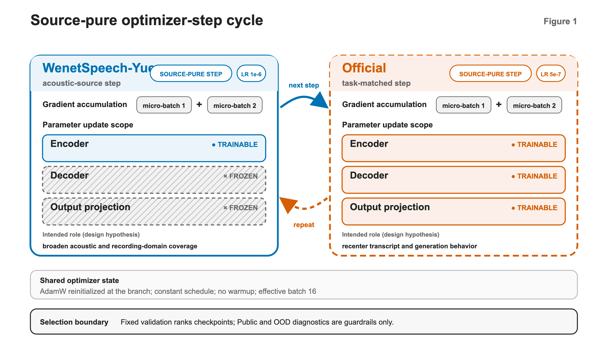

# A Source-Alternating Curriculum for Cantonese Speech Recognition with Whisper

**Authors:** [[TO BE CONFIRMED BY THE AUTHOR TEAM]]

## Abstract

Cantonese speech recognition benefits from broad acoustic coverage while also
requiring consistent, task-matched transcription. We present a
source-alternating curriculum for adapting `openai/whisper-small`. Every
WenetSpeech-Yue optimizer step uses a source-pure batch and updates the encoder,
whereas the alternating task-provided steps update the full model. A fixed validation
set controls checkpoint selection, with a task-provided local test set and an
out-of-domain (OOD) set providing complementary evaluation. The released
source-alternating Whisper-small checkpoint achieves 85.47% tolerance-two
accuracy and 8.59% CER on the validation set, and 89.42% tolerance-two accuracy
and 8.13% CER on the task-provided local test set. P0 and paired-seed P1 studies
record the decoding, task-matched recentering, and augmentation decisions that
preceded the release. P2 is a matched-budget early-adaptation study of six
Whisper-size and Full-SFT/LoRA arms, each trained for 150 optimization steps on
2,400 examples with global batch 16 and a single seed. Under this fixed budget,
the Full-SFT arms exhibit a local capacity trend, while the registered LoRA
recipes reduce trainable parameters and peak allocated memory. Tokenizer,
character 5-gram, and three-model fusion analyses do not motivate a change to
the released inference path. We release the checkpoint together with its
configuration, artifact hashes, package-parity record, and reproducibility
documentation.

## 1. Introduction

Cantonese ASR adaptation depends on both the amount and the role of available
supervision. Cantonese corpora differ in acoustic domain, speaker population,
annotation policy, and transcription convention, as illustrated by MDCC and
WenetSpeech-Yue [@mdcc_2022; @wenetspeech_yue_2025]. A broad source can expose
a recognizer to more speakers and recording conditions. A smaller
task-provided corpus can instead anchor the text convention used for
evaluation. This difference motivates a practical question: how should the two
sources update a pretrained encoder-decoder recognizer when they should not be
treated as interchangeable training examples?

**Figure 1.** Source-pure WenetSpeech-Yue steps update the encoder. Alternating
steps from the task-provided training split update the complete Whisper-small
model. A fixed validation set controls checkpoint selection, while the local
test and OOD sets provide complementary evaluation.

Pretrained speech models offer several ways to constrain adaptation, but the
choice of constraint is usually applied to an entire run. Self-supervised and
multilingual systems learn reusable representations [@wav2vec2_2020;
@xlsr_2021; @mms_2023], while Whisper provides a weakly supervised
encoder-decoder foundation that supports full or selective fine-tuning
[@whisper_2022]. LoRA, encoder-only adaptation, adapters, and weight averaging
restrict parameter change in different ways [@lora_2021; @lora_whisper_2024;
@s2lora_2024; @takashima_encoder_2022; @adapter_cf_2023;
@weight_averaging_cf_2023]. These approaches make selective updating a
practical design variable. The remaining design question is whether update
scope can be conditioned on the active data source while preserving a coherent
trainable mask within every accumulated optimizer step.

This report evaluates that source-conditioned rule in a completed Cantonese
system. The curriculum starts from an encoder-adapted Whisper-small checkpoint,
alternates broad-source encoder updates with task-provided full-model updates,
and uses fixed validation for checkpoint selection. The released checkpoint
reaches 85.47% tolerance-two accuracy with 8.59% CER on validation, and 89.42%
with 8.13% CER on the local test set. P0 records earlier completed studies,
paired-seed P1 resolves decoding, recentering, and augmentation decisions, and
P2 examines early adaptation across model sizes and Full-SFT/LoRA recipes.
Tokenizer behavior, rescoring, fusion, generation health, and resource use are
reported as diagnostics tied to their registered experimental settings.

The report makes three evidence-bounded contributions:

1. We specify a source-conditioned, source-pure curriculum in which
   WenetSpeech-Yue encoder-only updates and task-provided full-model updates
   alternate within one fixed optimizer-step cycle.
2. We document a released Whisper-small Cantonese system selected on a fixed
   validation set, and bind its reported results to the published weights with
   artifact hashes and a 32-item inference-parity check.
3. We consolidate completed P0-P2 studies of decoding, task-matched
   recentering, augmentation, early adaptation, parameter-efficient tuning,
   tokenizer behavior, language-model rescoring, model fusion, generation
   health, and resource use.

## 2. Model and Training Strategy

### 2.1 Architecture and Source Roles

The method changes the adaptation schedule rather than the recognizer
architecture. The released system retains the `openai/whisper-small`
architecture and tokenizer. Whisper converts audio into encoder
representations and generates text autoregressively with a Transformer decoder.
Both components retain their pretrained structure. The curriculum controls
which existing parameters are trainable for each source.

The two Cantonese sources have distinct operational roles. A filtered
WenetSpeech-Yue stream provides broader acoustic exposure. The second source is
the task-provided Cantonese training split (denoted `Official` in the
experiment artifacts). WenetSpeech-Yue examples drive encoder adaptation,
whereas task-provided examples periodically update the complete learnable
model. This division specifies how gradients are applied. It does not assume a
strict acoustic-linguistic separation between the encoder and decoder.

### 2.2 Source-Alternating Training Strategy

The curriculum is defined at optimizer-step granularity. Let Whisper parameters
be partitioned into encoder parameters \(\theta_E\) and the remaining decoder
and output parameters \(\theta_D\). At step \(t\), the source label \(s_t\) is
WenetSpeech-Yue (\(W\)) or the task-provided split (\(T\)), and the trainable
set is

\[
\Theta(s_t)=
\begin{cases}
\{\theta_E\}, & s_t=W,\\
\{\theta_E,\theta_D\}, & s_t=T.
\end{cases}
\]

The fixed cycle contains two source-conditioned update stages.

1. **WenetSpeech-Yue update.** Decoder and output parameters are frozen, and
   the source-pure broad-corpus gradient updates only the encoder.

2. **Task-provided update.** Every learnable encoder, decoder, and output
   parameter is enabled. Fixed positional embeddings remain fixed according to
   the underlying Whisper implementation and are not counted as a departure
   from Full SFT.

Source purity makes the alternating masks operationally well defined. Every
microbatch accumulated for an update comes from the same source, and training
alternates the two sources in a fixed cycle. For a source-pure accumulated
batch \(B_t\), the update is

\[
g_t^{(s_t)} =
\nabla_{\Theta(s_t)}
\operatorname{mean}_{(x,y)\in B_t}
\mathcal{L}_{\mathrm{Whisper}}(x,y;\theta),
\qquad
\Theta(s_t) \leftarrow
\operatorname{AdamW}_{\eta_{s_t}}
\left(\Theta(s_t),g_t^{(s_t)}\right).
\]

Parameters outside \(\Theta(s_t)\) remain unchanged, and the learning rate
\(\eta_{s_t}\) follows the active source. Source purity prevents one accumulated
gradient from mixing examples governed by different trainable sets. Recurrent
task-provided updates then act on the text-generating pathway between blocks of
broad-source encoder exposure. Our evidence supports the registered curriculum
as an integrated training recipe that combines source-conditioned update scope
with fixed source alternation.

The continuation follows nested duration milestones along one prepared stream.
It begins from an encoder-only checkpoint at 35.10 h of cumulative
WenetSpeech-Yue exposure and evaluates 40 h, 45 h, and 50 h milestones drawn
from a filtered 500 h pool. The milestone labels refer to cumulative exposure,
not to the size of a redistributed corpus. Task-provided full-model updates
occur throughout the continuation, and the checkpoint at the final reported
milestone is retained as the released system.

### 2.3 Released Configuration and Inference

The released optimization configuration is fixed independently of the later
P1 and P2 studies. The continuation reinitializes AdamW and uses a constant
schedule without warmup, an effective batch size of 16, a WenetSpeech-Yue
learning rate of 1e-6, and a task-provided learning rate of 5e-7. Weight decay
is 0.01, maximum gradient norm is 1.0, and the run uses seed 42 with bfloat16
and TF32 enabled. SpecAugment is disabled for this continuation.

**Table 1. Released training and inference configuration.**

| Component | Frozen value |
|---|---|
| Base model | openai/whisper-small |
| WenetSpeech-Yue step | Encoder trainable; learning rate 1e-6 |
| Task-provided step | All learnable parameters trainable; learning rate 5e-7 |
| Optimizer | Reinitialized AdamW; weight decay 0.01 |
| Schedule | Constant; no warmup |
| Effective batch | 16 examples per optimizer step |
| Precision | bfloat16 with TF32 enabled |
| Gradient clipping | Maximum norm 1.0 |
| Training seed | 42 |
| Released augmentation | None |
| Released decoding | language zh; task transcribe; one beam; maximum length 225; no-repeat n-gram 4; repetition penalty 1.05 |

Released inference uses language `zh`, task `transcribe`, one decoding beam,
maximum length 225, no-repeat n-gram size 4, and repetition penalty 1.05. These
values define the package-bound inference path. Separately registered P1 and P2
diagnostic decoders include two- and five-beam variants. Their measurements are
reported only for the checkpoint and configuration on which they were run.

## 3. Experiments

### 3.1 Evaluation Details

The task-provided training and local-test materials were distributed for the
preliminary Cantonese ASR task of the [AI Dimsum
Cup](https://www.aicompetition-pz.com/topic_detail/19). The task page identifies
the [Cantonese Life Scenarios
Corpus](https://huggingface.co/datasets/leeduckgo/cantonese-life-scenarios-corpus)
as its public data source. The current Hugging Face dataset page is cited for
provenance only. It is not asserted to be the exact revision used during
training. The task-provided training split contains 6,292 utterances (6.27 h),
and the fixed validation split contains 702 utterances (0.70 h). The released
continuation uses the training split for full-model updates and a nested,
filtered WenetSpeech-Yue stream for encoder-only updates. Evaluation examples
do not enter gradient updates.

**Table 2. Data and evaluation roles.**

| Surface | Size or exposure | Role | Use in the study |
|---|---:|---|---|
| Task-provided training split | 6,292 utterances / 6.27 h | Full-model updates | Training |
| Filtered WenetSpeech-Yue | 35.10 h start; 40/45/50 h milestones | Encoder-only continuation | Training |
| Fixed validation set | 702 utterances / 0.70 h | Primary evaluation | Checkpoint and diagnostic-choice selection |
| Task-provided local test set | 1,900 utterances | Task-aligned evaluation | Supplementary evaluation |
| OOD set | 2,000 utterances | Distribution-shift evaluation | Supplementary evaluation |
| P2 fixed exposure | 2,400 unique examples from `external73` | Early-adaptation stream | P2 training |

The task-provided local test set (denoted `Public` in the experiment artifacts)
contains 1,900 utterances and provides a second task-aligned measurement. It is
reported alongside validation to show how the selected checkpoint behaves on
additional task-provided audio. The fixed validation set remains the sole
surface for checkpoint selection and for choosing the language-model weight or
fusion rule.

The OOD set contains 2,000 utterances drawn from a different distribution. It
is included to characterize sensitivity to domain shift and to identify
robustness priorities. It supplies a distinct evaluation condition rather than
an additional source of training examples.

P2 is kept separate from the released continuation. It is a matched-budget
early-adaptation study with six Small, Medium, and Large-v2 Full-SFT/LoRA arms.
Each arm starts from its original OpenAI snapshot and receives the same ordered
2,400 training examples for 150 optimization steps, with global batch 16 and a
single seed (42). The shared `external73` stream contains task-provided, Common
Voice zh-HK, and MDCC-derived training examples. Validation, local-test, and
OOD references remain outside that stream.

Evaluation follows the task-defined character-level scoring protocol.
References retain their label text and undergo punctuation, whitespace, and
optional prefix removal. Predictions first undergo OpenCC
traditional-to-simplified conversion and then the same punctuation and
whitespace cleanup. This asymmetric normalization is part of the frozen metric:
applying conversion to both sides would define a different evaluation.
Local-test references come from the registered reference-text field. No
reference is reconstructed from an audio filename or translation field.

Character error rate (CER) is

\[
\mathrm{CER} =
\frac{\sum_i (S_i+D_i+I_i)}
     {\sum_i |\mathrm{reference}_i|},
\]

where \(S\), \(D\), and \(I\) denote character substitutions, deletions, and
insertions after normalization. Sentence-level tol0, tol1, and tol2 report the
percentage of utterances with edit distance equal to zero, at most one, and at
most two. A severe error has character edit distance greater than five. CER
summarizes aggregate character edits, whereas the tolerance measures describe
utterance-level acceptance at fixed edit thresholds. Both are reported because
they need not move identically.

Generation diagnostics distinguish an observed decoding failure from token-side
bookkeeping. The records include token cycles, repeated text, replacement
characters, effective maximum-length hits, output-token distributions, and
whether the returned sidecar contains an EOS token. A missing EOS entry alone
is not classified as a runaway. In several P2 Medium and Large-v2 evaluations,
the Transformers generation path did not retain EOS in the sidecar even though
the outputs stopped normally and showed no cycle or maximum-length hit.

Checkpoint selection uses only the fixed validation set. Within a registered
family, validation CER, tolerance-two accuracy, severe-error count, and
prespecified tie-breaks determine the selected candidate. Local-test and OOD
results are then reported for that fixed choice. They do not select a
checkpoint, a language-model weight, or a fusion method.

The P1 augmentation decision adds a paired-seed condition: both seeds must meet
the validation tolerance guardrail, and each seed must improve CER over its
same-seed unaugmented control. P2 answers a different question by comparing the
early response of six registered recipes to an identical exposure budget.
Full SFT and LoRA therefore retain their registered, method-specific learning
rates while the ordered examples and number of optimizer steps remain fixed.

### 3.2 Released System

The released source-alternating Whisper-small checkpoint is the final 50 h
milestone described in Section 2.2. The released source-alternating
Whisper-small checkpoint achieves 85.47% tolerance-two accuracy and 8.59% CER
on the validation set, and 89.42% tolerance-two accuracy and 8.13% CER on the
task-provided local test set. Table 3 reports these two task-aligned surfaces
with the OOD measurement.

**Table 3. Released checkpoint results. Metrics are percentages; higher tol2
and lower CER are better.**

| Surface | Items | tol2 (%) | CER (%) | Evaluation role |
|---|---:|---:|---:|---|
| Fixed validation set | 702 | 85.47 | 8.59 | Checkpoint selection |
| Task-provided local test set | 1,900 | 89.42 | 8.13 | Task-aligned evaluation |
| OOD set | 2,000 | 33.15 | 34.04 | Distribution-shift evaluation |

The validation measurement is attached to the selected checkpoint rather than
to an averaged or post-selected ensemble. The 702-utterance surface yields
607 substitutions, 103 deletions, and 94 insertions after normalization, with
14 utterances above the severe-error threshold. These counts provide the
auditable basis for the reported 8.59% CER.

The local test set supplies an additional task-aligned measurement for the
fixed release. Its 1,900 utterances yield 1,704 substitutions, 101 deletions,
and 23 insertions, with eight severe errors. The resulting 89.42% tol2 accuracy
and 8.13% CER are consistent with the validation profile under the same
normalization and inference configuration.

The OOD set remains more challenging, with 33.15% tolerance-two accuracy and
34.04% CER, motivating robustness-oriented extensions. Its 8,075
substitutions, 81 deletions, 48 insertions, and 515 severe errors show that the
difference is distributed across many utterances rather than being explained
only by a small number of extreme outputs.

Together, the three surfaces describe the released system under task-aligned
and distribution-shift conditions. Validation supplies the reproducible
selection point, while the local-test and OOD measurements broaden the
reported evaluation without changing the selected checkpoint.

### 3.3 P0-P1 Development Studies

P0 and P1 turn earlier experiments into three concrete design decisions for the
released system and its follow-up analyses. P1 tests static decoding on the
released checkpoint, short recentering on the task-provided training split,
and one augmentation family at a time. Recentring and augmentation use seeds
42 and 43. The registered augmentation rule requires each seed to improve CER
over its same-seed unaugmented control while satisfying the validation
tolerance guardrail.

**Table 4. P1 decision summary under validation-only ranking.**

| Question | Selected result | Validation tol2 (%) | Validation CER (%) | Decision |
|---|---|---:|---:|---|
| Static decoding | Five beams | 85.90 | 8.50 | Selected for this checkpoint |
| Task-matched recentering | Full SFT, LR 1e-6, two-seed mean | 86.97 | 8.26 | Selected recentering family |
| Single-axis augmentation | Gaussian noise, p=0.5, SNR 15-25 dB | 87.46 / 87.32 | 8.24 / 8.20 | Selected for both seeds |
| Validation-selected P1 endpoint | Gaussian-noise S43, D0 | 87.32 | 8.21 | Highest registered validation rank |

The decoding study isolates inference from weight changes. Eight arms vary
beam count, output-length limit, repetition penalty, or character-level
minimum Bayes risk (MBR) selection. Five-beam decoding is selected with 85.90%
validation tol2 accuracy and 8.50% CER. The same decoder produces 8.05% CER on
the local test set and 33.94% CER on OOD. Character MBR reaches a slightly
higher validation tol2 of 86.04% but a higher CER of 8.51% and a substantially
longer recorded runtime, so the CER-first rule selects ordinary five-beam
decoding for this checkpoint.

The recentering study starts every arm from the released checkpoint and uses
only the task-provided training split. The matrix crosses decoder-only and Full
SFT, learning rates 5e-7 and 1e-6, and seeds 42 and 43. Each arm runs for at
most 150 optimizer steps on 2,400 task-provided exposures, with candidate
checkpoints at 25-step intervals. Full SFT at 1e-6 has the best paired-seed mean
with 86.97% validation tol2 accuracy and 8.26% CER. Decoder-only 1e-6, Full SFT
5e-7, and decoder-only 5e-7 follow by mean CER, establishing Full SFT at 1e-6
as the task-matched recentering recipe used in the next study.

The augmentation study holds Full SFT, learning rate 1e-6, 150 steps, and both
seeds fixed while varying one augmentation axis. SpecAugment, speed
perturbation, Gaussian noise, and a telephone-band channel are mutually
exclusive, and evaluation preprocessing remains clean. Gaussian noise with
probability 0.5 and SNR 15-25 dB is the only tested family for which both seeds
improve CER over their same-seed controls and satisfy the validation rule.
SpecAugment improves selected tol2 values, but it does not meet the paired CER
criterion. Speed and telephone-channel perturbation also remain below the
registered selection threshold.

Independent endpoint evaluation places the seed-43 Gaussian-noise arm first on
validation, at 87.32% tol2 accuracy and 8.21% CER. Its OOD CER is 34.08%, close
to the released checkpoint's 34.04%. The seed-43 Full-SFT control records the
best local-test values among these P1 single models, at 89.63% tol2 and 7.96%
CER, but checkpoint selection remains tied to validation. Both packaged
candidates pass the 32-item offline check, raw/package prediction parity,
single-weight archive inspection, and weight-hash verification. These P1
artifacts remain development checkpoints. The source-alternating 50 h
checkpoint remains the released system.

Earlier completed studies establish the sequence of design choices that led to
the curriculum. In a fixed-data comparison, the best Full-SFT arm reaches
84.62% validation tol2 accuracy and the best LoRA arm reaches 68.38%, a local
gap of 16.24 percentage points under that experiment's configurations. In a
separate Round 12 study, the best of four mixed or sequential
WenetSpeech-Yue runs reaches 81.34% validation tol2 accuracy, compared with
85.47% for the later released checkpoint. These observations directed the
subsequent work toward recurring task-provided updates and a fixed
source-alternating cycle.

Selective-update, staged-curriculum, and duration studies add further design
evidence. A task-provided recentering study selects full-model updating at
learning rate 1e-6 and step 150, reaching 84.76% validation tol2 and 8.98% CER.
An incremental encoder-only study finds no new WenetSpeech-Yue checkpoint above
its step-zero model. A later encoder-decoder curriculum produces eligible local
candidates through short decoder calibration and continued acoustic exposure.
Finally, the selected eight-epoch SpecAugment run reaches its best validation
point at epoch seven, supporting milestone-based selection rather than relying
only on the terminal checkpoint.

Across P0 and P1, three decisions carry forward: five-beam decoding improves
the frozen checkpoint under the registered CER-first rule, short task-matched
Full SFT is the selected recentering recipe, and Gaussian noise is the only
tested augmentation family that satisfies the paired-seed criterion. The
earlier studies also motivate recurring task-provided updates and intermediate
checkpoint evaluation, which become explicit parts of the reported training
and selection workflow.

### 3.4 P2 Matched-Budget Early-Adaptation Study

P2 examines how model capacity and update scope affect the first part of
adaptation under a common exposure budget. The study contains six Small,
Medium, and Large-v2 Full-SFT/LoRA arms. Every arm consumes the same ordered
2,400 training examples for 150 optimization steps with global batch 16 and a
single seed (42). Small Full and Small LoRA run on one GPU, Medium Full uses
two-GPU FSDP, Large-v2 Full uses four-GPU FSDP, and the remaining LoRA arms run
on one GPU. The topology-aware sampler reconstructs the same 16 global example
identifiers at every step, so world size does not change the exposure stream.
Full SFT uses learning rate 1e-5. The registered LoRA recipe uses learning rate
1e-4, rank 8, alpha 16, dropout 0.05, and query/value adapters in encoder
self-attention, decoder self-attention, and decoder cross-attention.

**Table 5. P2 matched-budget early adaptation. All accuracy and CER values are
percentages. Every arm uses 2,400 examples, 150 steps, global batch 16, and
seed 42.**

| Arm | Val tol2 (%) | Val CER (%) | Local-test CER (%) | OOD CER (%) | Trainable (%) | Peak allocated (GiB) |
|---|---:|---:|---:|---:|---:|---:|
| Small Full | 63.53 | 16.24 | 15.30 | 38.20 | 99.52 | 4.99 |
| Small LoRA | 53.85 | 20.65 | 18.48 | 41.22 | 0.36 | 2.10 |
| Medium Full | 71.51 | 13.41 | 9.56 | 38.42 | 99.80 | 7.12 |
| Medium LoRA | 50.43 | 23.26 | 19.20 | 45.50 | 0.31 | 3.93 |
| Large-v2 Full | 80.34 | 10.29 | 6.64 | 34.59 | 99.88 | 10.80 |
| Large-v2 LoRA | 78.92 | 11.29 | 8.64 | 36.23 | 0.25 | 6.58 |

All six arms improve both validation tol2 and CER relative to their own
unadapted step-zero checkpoints. Within the Full-SFT recipe, early-adaptation
performance increases from Small to Medium to Large-v2: validation tol2 rises
from 63.53% to 71.51% and 80.34%, while CER falls from 16.24% to 13.41% and
10.29%. This matched-budget trend indicates that the larger Full-SFT models use
the first 2,400 examples more effectively under the registered schedule.

The LoRA arms quantify an accuracy-memory trade-off for the registered adapter
configuration. At step 150, their validation metrics remain below the
same-size Full-SFT arms, while their trainable shares fall to 0.36%, 0.31%, and
0.25% for Small, Medium, and Large-v2. Peak allocated memory is also lower for
each same-size comparison. GPU-hours follow a less uniform pattern: Small and
Medium LoRA take more GPU-hours than their Full-SFT counterparts, whereas
Large-v2 LoRA uses fewer than the four-GPU Large-v2 Full run. The result
separates parameter and memory savings from end-to-end runtime behavior.

Large-v2 Full records the lowest local-test CER among the P2 arms at 6.64%,
with 80.34% validation tol2 and 34.59% OOD CER. These measurements belong to
the P2 early-adaptation protocol, while the released system remains the
source-alternating Whisper-small checkpoint selected under the protocol in
Section 3.2. These findings motivate scaling the source-alternating curriculum
to Large-v2 with longer training and multi-seed evaluation.

### 3.5 Tokenizer, Rescoring, and Fusion Diagnostics

Table 6 separates three diagnostic decisions that could otherwise be mistaken
for one enhancement pipeline. Tokenizer analysis asks whether the audited text
is representable and how it is segmented. LM rescoring and model consensus ask
whether fixed candidate sets support a validation-selected inference change.
Reference-dependent oracle rows estimate headroom but cannot select a
deployable path.

**Table 6. Diagnostic decisions. CER values are percentages; oracle rows are
reference-dependent analysis bounds.**

| Diagnostic | Validation decision | Main observation | Deployment outcome |
|---|---|---|---|
| Tokenizer/Unicode | Same tokenizer across three sizes | No UNK or Unicode corruption; measurable multi-token inefficiency | No tokenizer change |
| Character 5-gram LM | lambda 0.0 | CER 8.53% versus top-1 8.50% and oracle 8.44% | Release unchanged |
| Three-model consensus | MBR selected over ROVER | Val CER 8.23% versus best single 8.21%; local test 7.91%; OOD 34.01% | Release unchanged |
| Best-of-three oracle | Reference-dependent | CER 7.59%/7.18%/33.72% on validation/local test/OOD | Complementarity diagnostic |

The tokenizer audit first establishes representational coverage and identity.
Whisper Small, Medium, and Large-v2 share tokenizer hash
cd04663643cab3e7a63a1f4cf2d7913e957183dbfb1b3aaebd97992083b8af36,
and all audited surfaces contain zero unknown tokens, replacement characters,
control or surrogate characters, or NFC/NFKC changes. Model-size differences
in P2 therefore do not arise from different tokenizers, and the audited
Cantonese text is representable without an unknown-token path.

Coverage and segmentation efficiency are separate properties. Common
Cantonese characters such as 唔, 冇, 喺, 咗, 嘅, 啲, 佢, 嚟, and 咁 use two
tokenizer IDs in the audit. The local-test single-character multi-token rate is
34.57%, compared with 31.35% on validation and 28.78% on OOD. These
measurements identify a concrete segmentation overhead and motivate a
controlled vocabulary-extension study. They do not attribute current CER to
the tokenizer.

The character language-model experiment tests whether textual preference can
select a better item from the released checkpoint's five-best list. A
character 5-gram model is trained only on `external73` training text with
additive smoothing 0.1.
Candidate-level ASR sequence scores and per-character LM scores are normalized
within each utterance and combined over lambda values 0.0, 0.1, 0.2, 0.4, and
0.8. Validation selects lambda 0.0, so the 5-gram component is not added to the
released inference path. Validation CER is 8.50% for top-1 decoding, 8.53% for
the registered LM path, and 8.44% for the reference-dependent five-best oracle.
The small oracle gap remains available for future rescoring studies without
changing the present release.

P2 also tests prediction-level complementarity among the released checkpoint,
the seed-43 Gaussian-noise checkpoint, and the seed-43 Full-SFT checkpoint.
Three-hypothesis MBR selects the medoid by total character edit distance, while
character ROVER aligns and votes around the MBR anchor. Validation chooses
between MBR and ROVER. References are used only for the best-of-three oracle.
MBR is selected over ROVER, producing 8.23% validation CER, 7.91% local-test
CER, and 34.01% OOD CER. The best registered single model remains better on
validation at 8.21% CER, so the released inference path is unchanged.

The fusion results separate prediction diversity from a usable system change.
The reference-dependent oracle reaches 7.59%, 7.18%, and 33.72% CER on
validation, local test, and OOD, respectively, showing that the three systems
make complementary errors. Static MBR captures only part of that headroom,
remains behind the best single model on validation, and requires three model
inference paths. The diagnostic therefore motivates learned or conditional
fusion research without adding static consensus to the released system.

### 3.6 Error, Stability, and Efficiency

The released error counts show that substitutions dominate every evaluated
surface. Validation contains 607 substitutions, 103 deletions, and 94
insertions, with 14 utterances above the severe-error threshold. The local test
set contains 1,704 substitutions, 101 deletions, and 23 insertions, with eight
severe errors. OOD contains 8,075 substitutions, 81 deletions, and 48
insertions, with 515 severe errors. The count profile complements CER by showing
how edit types and high-error utterances change across domains.

The released local-test diagnostics contain zero repeated-runaway outputs,
zero replacement-character outputs, and zero effective maximum-length hits.
P2 extends the same health check to all 18 model-by-surface endpoints. Every
endpoint passes row/order guards and records zero true repeated runaways and
zero effective maximum-length hits. Small Full produces six replacement
characters on the local test set, which is recorded separately from repeated
generation and EOS-sidecar bookkeeping.

P2 resource measurements pair accuracy with the hardware path used by each
arm. Training cost ranges from 0.0749 GPU-h for Small Full to 1.0599 GPU-h for
Large-v2 Full. Batch-one real-time factor on a fixed 32-item subset ranges from
0.0268 to 0.0720. The registered LoRA arms reduce trainable parameters and peak
allocated memory, whereas total GPU-hours reflect the combined effects of
model size, world size, FSDP communication, gradient checkpointing, and
adapter execution. Appendix B retains the complete measured surface.

The engineering record documents recovery of four implementation failures.
BF16 autocast initially failed during FSDP generation for Medium Full, after
which the evaluator path was corrected and smoke-tested without changing the
training data. The verifier was extended to validate Large-v2's sharded
safetensors index, shards, and surface hash. A Medium Full final-evaluation call
also failed after the complete step-150 checkpoint had been saved. An
independent verifier confirmed the checkpoint and exposure receipts before the
endpoint was evaluated. Launcher spelling errors were detected before training
exposure and did not alter any registered run.

## 4. Reproducibility and Release

### 4.1 Released Artifact Identity and Package Parity

The release binds the selected training state, packaged weights, and inference
path. The preserved flat archive has SHA-256
`b4fda8ac549d37d8cac9797950636d50ca28f74d8e5e76e2479c15de9b956bc5`,
and the released `model.safetensors` has SHA-256
`a0f29a5a011213d5e4de34c40a02d42247255645f06e649e092d2dc495094370`.
The archive is flat, contains exactly one `model.safetensors` file, and passes
offline inference and order checks on 32 samples.

A fixed 32-item offline audit finds no text or token mismatches between the raw
checkpoint, the extracted release package, and the bundled inference path.
This parity result verifies that the published weight file and inference entry
point reproduce the audited checkpoint outputs on the fixed subset.

### 4.2 P1 and P2 Provenance

P1 development packages retain separate model and archive hashes, 32-item
offline results, prediction parity, and flat-archive checks. P2 applies the
same fail-closed approach to topology-aware exposure, model conversion, FSDP
state export, LoRA trainable scope, evaluation row/order parity, and
configuration and weight hashes. These records keep the released system,
development candidates, and early-adaptation arms distinguishable.

The P2 evidence freeze binds the registered configuration and four local
machine matrices to SHA-256
b4e84337d5d51011e6325f651c390116abea0f416efd093cf2b0338de7cb3f47,
1ed5a1f1d1a982b957b021402e6e22478d05ba37974ccab93997e4ac4e744ff4,
90fccd3010f3e39a911bdccabf5c4920b3083a5f8f668812c211c57fdc24a8c9,
23f04a566ba7d07dde64d5f55637b2871c2b39fdf1935f49ae99712132be91ed,
and dd7683883750e90b9a699b0a0644c543783968b23b04baeefcb7f0ce8f94614d
for the config, capacity, tokenizer, LM, and fusion records respectively.
These content hashes identify the exact matrices from which the P2 tables were
derived.

### 4.3 Reproduction Boundary

The released weights and model card are available from [Hugging
Face](https://huggingface.co/cantonese-asr-lab/whisper-small-cantonese-w500-adaptive),
and training, evaluation, packaging, and verification code is available from
the [project repository](https://github.com/Vanxun-Hank/cantonese-asr). The
released model weights are licensed under the Apache License 2.0.
Reproducing the reported inference path requires the weight files, the
language/task prompt, decoding arguments, text normalizer, and example order.
Training data is not bundled with the model. Users must obtain each source
under its own access and license terms and reconstruct only permitted
manifests. Information identifying the exact training-time task-data snapshot
is available from the corresponding author by email; the contact address will
be added with the final author record. The repository contains versioned
configurations, code, and compact reports. Hashes identify larger experiment
artifacts that are not distributed with a standard Git clone.

## 5. Limitations

The released curriculum is evaluated as an integrated recipe. Its
source-conditioned update scope, learning rates, starting checkpoint, total
exposure, and alternation frequency were not independently crossed in a single
factorial experiment. The completed comparisons support the design sequence
and the performance of the registered recipe, while a component-level causal
decomposition remains future work.

The evaluation surfaces cover one task-defined character protocol. The local
test set is task-provided and task-aligned, while the OOD set represents one
additional distribution rather than the full range of Cantonese speech. The
reported values therefore characterize the released checkpoint on these
specific surfaces. Broader claims require independent datasets with documented
speaker, acoustic, linguistic, and transcription diversity.

P1 and P2 have different uncertainty profiles. P1 family decisions use seeds
42 and 43 with paired rules, which provides only a limited estimate of
run-to-run variation. P2 uses one seed, 150 optimizer steps, and 2,400 examples
per arm. Its scope is fixed-budget early adaptation rather than convergence,
and the Full-SFT and LoRA learning rates are recipe-specific. Longer,
multi-seed runs with model-specific tuning are needed to characterize
converged size and adaptation-method behavior.

Hardware, diagnostics, and metrics each have a defined measurement scope.
Small and LoRA arms use one GPU, Medium Full uses two-GPU FSDP, and Large-v2
Full uses four-GPU FSDP, so communication, checkpointing, model size, and
adapter execution all influence wall time and GPU-hours. Tokenizer segmentation
is observational because no replacement vocabulary was trained. The character
5-gram experiment covers one static reranker, and the reference-dependent
fusion oracle measures headroom rather than deployment performance. The frozen
character metric uses asymmetric
traditional-to-simplified normalization, punctuation removal, and short
edit-distance tolerances. It therefore does not measure punctuation, readable
traditional-character output, named entities, or semantic equivalence.
Aggregate edits do not identify the acoustic or linguistic source of OOD
errors without a separately designed stratified analysis.

Dataset access, privacy conditions, and redistribution boundaries remain
governed by the upstream sources. The final author record, corresponding-author
email, and venue-specific AI-use disclosure remain to be confirmed.

## 6. Conclusion

This report presents a source-alternating curriculum for Cantonese ASR in which
WenetSpeech-Yue steps update the encoder, task-provided steps update the full
model, and source-pure accumulation preserves one trainable mask per optimizer
step. The released Whisper-small checkpoint shows consistent task-aligned
validation and local-test performance, while the OOD evaluation identifies a
clear direction for robustness work. P0 and P1 establish the decoding,
recentring, augmentation, and checkpoint-selection decisions surrounding the
release. The matched-budget P2 study adds evidence about early capacity trends
and the accuracy, parameter, memory, and runtime trade-offs of the registered
Full-SFT and LoRA recipes. Tokenizer, language-model, and fusion diagnostics
further identify measurable segmentation overhead and unused hypothesis
complementarity without changing the released inference path. Artifact hashes,
public weights, and inference-parity checks connect these findings to a
reproducible release. These findings motivate scaling the source-alternating
curriculum to Large-v2 with longer training and multi-seed evaluation.

## Author Contributions

[[TO BE CONFIRMED WITH THE FINAL AUTHOR RECORD.]]

## Data and Code Availability

Model weights and the inference package are available from the [Hugging Face
model repository](https://huggingface.co/cantonese-asr-lab/whisper-small-cantonese-w500-adaptive).
The released model weights are licensed under the Apache License 2.0.
Training, evaluation, packaging, and verification code is available from the
[project repository](https://github.com/Vanxun-Hank/cantonese-asr). Training
data is not redistributed with the model. Users must obtain each source under
its own terms. Information identifying the exact training-time task-data
snapshot is available from the corresponding author by email; the contact
address will be added when the final author record is confirmed.

## AI-Use Disclosure

[[TODO: venue-policy-compliant disclosure based on authorship.json. Human
authors remain fully accountable.]]

## References

Bibliographic records for the citation keys in this report are maintained in
[`references.bib`](references.bib).

# Appendix

## A. P0-P1 complete registered matrices

### A.1 P0 frozen baseline

| Surface | Rows | tol2 (%) | tol1 (%) | tol0 (%) | CER (%) | S/D/I | Severe | Top-20 contribution (%) | Repeat | Replacement | Max hit | no-EOS |
|---|---:|---:|---:|---:|---:|---|---:|---:|---:|---:|---:|---:|
| Validation | 702 | 85.47 | 70.94 | 45.44 | 8.59 | 607/103/94 | 14 | 17.29 | 0 | 0 | 0 | 201 |
| Local test | 1,900 | 89.42 | 75.16 | 45.00 | 8.13 | 1704/101/23 | 8 | 5.91 | 0 | 0 | 0 | 566 |
| OOD | 2,000 | 33.15 | 15.90 | 4.20 | 34.04 | 8075/81/48 | 515 | 4.08 | 0 | 0 | 0 | 535 |

P0 freezes the references, normalized predictions, ordering, and generation
sidecars used by all P1 checks. no-EOS remains a token-side observation rather
than a repeated-runaway count.

### A.2 P1 static decoding matrix

| Arm | Beams | Max length | No-repeat n-gram | Repetition penalty | Val tol2 (%) | Val CER (%) | Severe | Runtime (s) |
|---|---:|---:|---:|---:|---:|---:|---:|---:|
| D0_CURRENT | 2 | 225 | 4 | 1.05 | 85.47 | 8.59 | 14 | 85.40 |
| D1_BEAM1 | 1 | 225 | 4 | 1.05 | 85.47 | 8.59 | 14 | 84.20 |
| D2_BEAM4 | 4 | 225 | 4 | 1.05 | 85.90 | 8.56 | 13 | 91.25 |
| D3_BEAM5 | 5 | 225 | 4 | 1.05 | 85.90 | 8.50 | 12 | 60.66 |
| D4_MAX128 | 2 | 128 | 4 | 1.05 | 85.47 | 8.59 | 14 | 118.77 |
| D5_RP100 | 2 | 225 | 4 | 1.00 | 85.47 | 8.59 | 14 | 118.89 |
| D6_RP110 | 2 | 225 | 4 | 1.10 | 85.61 | 8.59 | 14 | 118.90 |
| D7_MBR_B5 | 5 | 225 | 4 | 1.05 | 86.04 | 8.51 | 13 | 215.74 |

The registered CER-first rule selects D3 rather than the higher-tol2 D7 MBR
arm. Runtime is the recorded local surface, not a hardware-independent
benchmark.

### A.3 P1 task-provided recentering matrix

| Arm | Selected step | Val tol2 (%) | Val CER (%) | Severe | Insertions |
|---|---:|---:|---:|---:|---:|
| Decoder 5e-7, S42 | 100 | 86.18 | 8.50 | 14 | 100 |
| Decoder 5e-7, S43 | 75 | 86.32 | 8.51 | 13 | 93 |
| Decoder 1e-6, S42 | 75 | 86.47 | 8.41 | 13 | 97 |
| Decoder 1e-6, S43 | 125 | 86.89 | 8.39 | 12 | 95 |
| Full 5e-7, S42 | 125 | 86.47 | 8.43 | 13 | 97 |
| Full 5e-7, S43 | 125 | 86.32 | 8.44 | 12 | 93 |
| Full 1e-6, S42 | 150 | 87.04 | 8.30 | 10 | 91 |
| Full 1e-6, S43 | 125 | 86.89 | 8.21 | 10 | 88 |

| Family | Paired-seed mean tol2 (%) | Paired-seed mean CER (%) |
|---|---:|---:|
| Full SFT, 1e-6 | 86.97 | 8.26 |
| Decoder-only, 1e-6 | 86.68 | 8.40 |
| Full SFT, 5e-7 | 86.40 | 8.44 |
| Decoder-only, 5e-7 | 86.25 | 8.50 |

Each arm is independently initialized from the released checkpoint, consumes
2,400 task-provided exposures, and selects among six registered checkpoints.

### A.4 P1 single-axis augmentation matrix

| Arm | Selected step | Val tol2 (%) | Val CER (%) | Paired-rule status |
|---|---:|---:|---:|---|
| SpecAugment S42 | 125 | 87.32 | 8.32 | Fail |
| SpecAugment S43 | 125 | 87.32 | 8.34 | Fail |
| Speed S42 | 50 | 86.47 | 8.50 | Fail |
| Speed S43 | 50 | 86.18 | 8.57 | Fail |
| Gaussian noise S42 | 75 | 87.46 | 8.24 | Pass |
| Gaussian noise S43 | 150 | 87.32 | 8.20 | Pass |
| Telephone channel S42 | 100 | 87.18 | 8.40 | Fail |
| Telephone channel S43 | 125 | 87.18 | 8.39 | Fail |

The status requires both seeds to pass the tol2 guardrail and improve CER over
their same-seed unaugmented controls.

### A.5 Independently reevaluated P1 endpoints

| Candidate | Val tol2 (%) | Val CER (%) | Local-test tol2 (%) | Local-test CER (%) | OOD tol2 (%) | OOD CER (%) |
|---|---:|---:|---:|---:|---:|---:|
| Released, D0 | 85.47 | 8.59 | 89.42 | 8.13 | 33.15 | 34.04 |
| Released, Beam5 | 85.90 | 8.50 | 89.58 | 8.05 | 33.30 | 33.94 |
| Gaussian-noise S43 | 87.32 | 8.21 | 89.26 | 8.04 | 33.20 | 34.08 |
| Full-SFT 1e-6 S43 | 86.75 | 8.24 | 89.63 | 7.96 | 32.90 | 34.09 |

The Beam5 decoder is selected only for the released checkpoint. Independent
D0/Beam5 checks are required for every new weight, and P1 checkpoint selection
uses validation.

## B. P2 resource matrix

| Arm | Parameters | Trainable | Train s | GPU-h | Samples/s | Peak alloc/reserved GiB | Mean inference ms | RTF |
|---|---:|---:|---:|---:|---:|---|---:|---:|
| Small Full | 241.7 M | 240.6 M | 269.6 | 0.0749 | 8.904 | 4.99 / 5.79 | 85.9 | 0.0268 |
| Small LoRA | 242.6 M | 0.885 M | 328.5 | 0.0912 | 7.307 | 2.10 / 3.20 | 101.6 | 0.0317 |
| Medium Full | 763.9 M | 762.3 M | 279.4 | 0.1552 | 8.590 | 7.12 / 10.31 | 129.2 | 0.0403 |
| Medium LoRA | 766.2 M | 2.359 M | 1067.5 | 0.2965 | 2.248 | 3.93 / 4.26 | 172.0 | 0.0537 |
| Large-v2 Full | 1,543.3 M | 1,541.4 M | 953.9 | 1.0599 | 2.516 | 10.80 / 17.47 | 194.3 | 0.0607 |
| Large-v2 LoRA | 1,547.2 M | 3.932 M | 2035.9 | 0.5655 | 1.179 | 6.58 / 6.95 | 230.6 | 0.0720 |

Inference uses 32 examples at batch one. GPU-hours multiply wall time by world
size and are not topology-normalized.

## C. P2 endpoint and artifact identity

### C.1 Six-arm endpoint metrics

| Arm | Validation tol2/CER (%)/Severe | Local-test tol2/CER (%)/Severe | OOD tol2/CER (%)/Severe |
|---|---|---|---|
| Small Full | 63.53 / 16.24 / 42 | 71.42 / 15.30 / 58 | 28.10 / 38.20 / 629 |
| Small LoRA | 53.85 / 20.65 / 82 | 63.63 / 18.48 / 82 | 25.65 / 41.22 / 723 |
| Medium Full | 71.51 / 13.41 / 39 | 85.37 / 9.56 / 7 | 28.75 / 38.42 / 652 |
| Medium LoRA | 50.43 / 23.26 / 119 | 62.95 / 19.20 / 137 | 23.80 / 45.50 / 835 |
| Large-v2 Full | 80.34 / 10.29 / 20 | 93.05 / 6.64 / 5 | 33.25 / 34.59 / 519 |
| Large-v2 LoRA | 78.92 / 11.29 / 22 | 89.21 / 8.64 / 17 | 31.25 / 36.23 / 573 |

All endpoint values are step-150 results under the matched exposure. The
validation column defines the within-study comparison. The other columns are
reported for the resulting fixed endpoints.

### C.2 Error counts, run configuration, and weight identity

| Arm | Val S/D/I | Local-test S/D/I | OOD S/D/I | Run-config SHA-256 | Weight artifact SHA-256 |
|---|---|---|---|---|---|
| Small Full | 1283/104/132 | 3228/125/85 | 9024/110/72 | 670ec0bbc2aebb7435cd593474c87d70996c5bc526b9b8d21b0f27a5891bba71 | 02dd4f3f74bd1f886a53f20f036bd3043c6d48050208ed8d6737a6f901b9e0e9 |
| Small LoRA | 1665/117/150 | 3798/241/115 | 9669/162/103 | 3ea732381d998875364ecda065f13ee17d1d351a600c930254c8f9bc5d4ae7d5 | 197b0c4156d535bd8fcdc4367db0115e9e08b194e2bc4d093801cb7b09bf3868 |
| Medium Full | 1021/95/139 | 1970/85/93 | 9066/86/108 | c0309645298f664f35fb7ec83c65abd6a129b19aafd3e6351b27688d9055474e | 8cb977fb711e332b36422b03691b8cbfbcb45ef48a571b2036735b5dd1727bba (surface) |
| Medium LoRA | 1774/202/200 | 3257/885/173 | 10428/372/166 | 8948bb1609177f4cfade1326ba363cae40e493254177b893f6fda87aeffd1dbe | dae52ba6f380a73b611602a53c7fc5ba1bb464163d0d5449ae77918b28415f34 |
| Large-v2 Full | 739/94/130 | 1404/66/22 | 8215/76/44 | ed1718b15073a84d78c16747ef54a0f8f9d31e306b22e84aa3b268d16a2fa430 | b904e014e7e3ba9b61aa40a506aa65153070c4a52d21a3781d6c300f1672e66a (surface) |
| Large-v2 LoRA | 818/81/157 | 1793/100/48 | 8530/141/59 | 0501850fd11238cdce6903032d068c8f4db731375e19d15e0d0fd941ceb2ac2b | 1c4db315cf5dfa6e0eef2fffba99ea0f823f066ab389c56eebce5b8819eafee6 |

For sharded models, a surface hash identifies the index and all shards rather
than one file.

## D. Tokenizer and Unicode audit details

| Surface | Samples | Characters | Tokens | Characters/token | Single-character multi-token rate (%) |
|---|---:|---:|---:|---:|---:|
| Task-provided train | 6,292 | 96,092 | 124,473 | 0.772 | 30.76 |
| Validation | 702 | 10,749 | 13,976 | 0.769 | 31.35 |
| Local test | 1,900 | 24,979 | 34,277 | 0.729 | 34.57 |
| OOD | 2,000 | 24,390 | 30,505 | 0.800 | 28.78 |

| Character | Token IDs |
|---|---|
| 唔 | 161, 9520 |
| 冇 | 5676, 229 |
| 喺 | 5234, 118 |
| 咗 | 8975, 245 |
| 嘅 | 10756, 227 |
| 啲 | 3284, 110 |
| 佢 | 1593, 95 |
| 嚟 | 29593, 253 |
| 咁 | 8975, 223 |

The three audited model sizes produce identical tokenization statistics.

## E. Language-model and fusion details

| Surface | Beam5 top-1 tol2/CER (%)/Severe | Existing MBR tol2/CER (%)/Severe | Selected 5-gram (lambda 0.0) tol2/CER (%)/Severe | Five-best oracle tol2/CER (%)/Severe |
|---|---|---|---|---|
| Validation | 85.90 / 8.50 / 12 | 86.04 / 8.51 / 13 | 85.90 / 8.53 / 13 | 86.18 / 8.44 / 12 |
| Local test | 89.58 / 8.05 / 8 | 89.53 / 8.06 / 8 | 89.58 / 8.05 / 8 | 89.58 / 8.03 / 8 |
| OOD | 33.30 / 33.94 / 511 | 33.30 / 33.94 / 512 | 33.30 / 33.94 / 512 | 33.30 / 33.94 / 511 |

Lambda is chosen on validation and applied unchanged to the local-test and OOD
surfaces. The oracle does not participate in lambda selection.

| Surface | Best registered single model tol2/CER (%) | MBR tol2/CER (%) | Oracle tol2/CER (%) |
|---|---|---|---|
| Validation | Gaussian-noise S43: 87.32 / 8.21 | 87.04 / 8.23 | 88.18 / 7.59 |
| Local test | Full-SFT 1e-6 S43: 89.63 / 7.96 | 89.84 / 7.91 | 91.16 / 7.18 |
| OOD | Released CER 34.04; Gaussian-noise tol2 33.20 | 33.20 / 34.01 | 33.60 / 33.72 |

The oracle uses references and serves only as a complementarity bound.

## F. P2 failures and reproducibility checks

The preserved P2 record includes the Medium Full BF16 generation correction,
Large-v2 sharded-safetensors verifier correction, launcher spelling failures,
and the post-save Medium Full evaluation exception. None changed the registered
training exposure after it began.

The acceptance surface requires matching configuration/data/model hashes,
byte-identical 16-example global exposure groups across one/two/four-GPU
topologies, LoRA-only trainable adapters in LoRA arms, complete row/order parity
for 702/1,900/2,000 endpoints, separate no-EOS and true-runaway diagnostics,
validation-only selection, and verified configuration and artifact identity.
Large server artifacts are identified by hashes even when they are absent from
a Git clone.
